# FitApp
#### Projeto de Conclusão do Curso de Pós Graduação Full Stack Development PUC-Minas
 
## Contexto

Independentemente do gênero, idade e condição socioeconómica, a melhoria ou manutenção de bons níveis de saúde e consequentemente da nossa qualidade de vida são objetivos comuns a todos nós.
É importante lembrar que ser saudável não significa apenas à ausência de doenças, mas também, a um bem-estar geral. Neste sentido, aliar uma alimentação saudável à prática de exercício físico nos ajuda a promover por mais tempo a saúde e bem-estar.
No entanto, com a correria dos dias de hoje, a desculpa da falta de tempo passa sempre a atividade física para segundo plano. Sem contar com o stress diário que nos leva a buscar saídas rápidas e erradas, em relação a alimentação.
Com isso, seguir um estilo de vida saudável tornou-se um dos maiores desafios da vida moderna. Por isso, a existência de uma ferramenta que consiste em planos de treino e alimentação totalmente personalizados, facilita e motiva a melhorar a qualidade de vida e bem-estar.
A figura a seguir, apresenta o método Lean Canvas para descrever o contexto e detalhes da ferramenta de forma prática e objetiva.

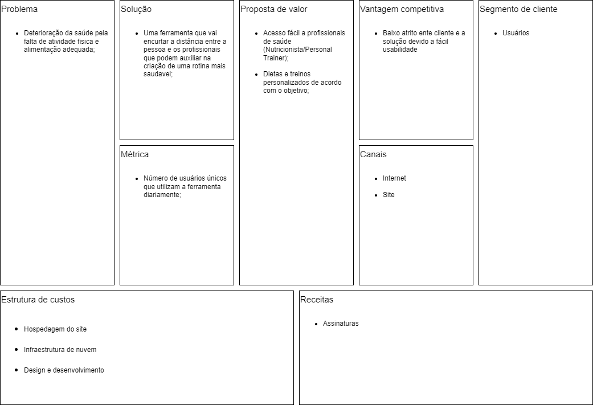

## Público alvo

Essa ferramenta irá ajudar todas as pessoas, a partir dos 16 anos, que querem adotar um estilo de vida mais saudável com a união de bons hábitos alimentares e à prática de exercícios físicos.

## Requisitos Funcionais

1. Gestão de conta

    * CU-G 01 - Fazer login
    * CU-G 02 - Fazer login via Facebook
    * CU-G 03 - Fazer login via Google
    * CU-G 04 - Redefinir senha
    * CU-G 05 - Fazer logout
    * CU-G 06 - Registrar novo Assinante

1. Administrador

    * CU-A 01 - Listar Assinantes
    * CU-A 02 - Listar Assinantes por nome
    * CU-A 03 - Ver dados cadastrais do Assinante
    * CU-A 04 - Bloquear e desbloquear Assinante
    * CU-A 05 - Listar Nutricionistas
    * CU-A 06 - Listar Nutricionistas por nome
    * CU-A 07 - Bloquear e Desbloquear Nutricionista
    * CU-A 08 - Cadastrar Nutricionista
    * CU-A 09 - Listar Personal Trainers
    * CU-A 10 - Listar Personal Trainers por nome
    * CU-A 11 - Bloquear e Desbloquear Personal Trainers
    * CU-A 12 - Cadastrar Personal Trainers
    * CU-A 13 - Listar Planos
    * CU-A 14 - Listar planos pelo nome
    * CU-A 15 - Ver dados do plano
    * CU-A 16 - Salvar alterações dos dados do plano
    * CU-A 17 - Cadastrar plano
    * CU-A 18 - Listar mensagens na caixa de entrada
    * CU-A 19 - Ver conteúdo da mensagem 
    * CU-A 20 - Responder mensagem
    * CU-A 21 - Excluir mensagem 
    * CU-A 22 - Escrever mensagem
    * CU-A 23 - Listar mensagens enviadas
    * CU-A 24 - Listar mensagens excluídas

1. Nutricionista

    * CU-N 01 - Ver perfil
    * CU-N 02 - Salvar alterações do perfil
    * CU-N 03 - Alterar Senha
    * CU-N 04 - Listar Pacientes
    * CU-N 05 - Listar Pacientes por nome
    * CU-N 06 - Ver dados do Paciente
    * CU-N 07 - Ver detalhes da dieta 
    * CU-N 08 – Incluir item na dieta
    * CU-N 09 – Editar item na dieta
    * CU-N 10 – Excluir item na dieta
    * CU-N 11 - Salvar alterações na dieta
    * CU-N 12 - Criar Dieta
    * CU-N 13 - Ver Histórico de medidas do Paciente
    * CU-N 14 - Ver histórico de peso do Paciente
    * CU-N 15 - Ver histórico de medida do Pescoço do Paciente
    * CU-N 16 - Ver histórico de medida da cintura do Paciente
    * CU-N 17 - Ver histórico quadril do Paciente
    * CU-N 18 - Ver histórico de IMC do Paciente
    * CU-N 19 - Gerar PDF do histórico de medidas do Paciente
    * CU-N 20 - Listar mensagens na caixa de entrada
    * CU-N 21 - Ver conteúdo da mensagem 
    * CU-N 22 - Responder mensagem
    * CU-N 23 – Excluir mensagem
    * CU-N 24 - Escrever mensagem
    * CU-N 25 - Listar mensagens enviadas
    * CU-N 26 - Listar mensagens excluídas

1. Personal Trainer

    * CU-P 01 - Ver perfil
    * CU-P 02 - Salvar alterações do perfil
    * CU-P 03 - Alterar Senha
    * CU-P 04 - Listar Alunos
    * CU-P 05 - Listar Alunos por nome
    * CU-P 06 - Ver dados do Aluno
    * CU-P 07 - Ver histórico de treinos
    * CU-P 08 - Ver detalhes do treino
    * CU-P 09 - Salvar alterações no treino
    * CU-P 10 - Criar Treino
    * CU-P 11 - Ver Histórico de medidas do Aluno
    * CU-P 12 - Ver histórico de peso do Aluno
    * CU-P 13 - Ver histórico de medida do Pescoço do Aluno
    * CU-P 14 - Ver histórico de medida da cintura do Aluno
    * CU-P 15 - Ver histórico quadril do Aluno
    * CU-P 16 - Ver histórico de IMC do Aluno
    * CU-P 17 - Gerar PDF do histórico de medidas do Aluno
    * CU-P 18 - Listar mensagens na caixa de entrada
    * CU-P 19 - Escrever mensagem
    * CU-P 19 - Ver conteúdo da mensagem 
    * CU-P 20 - Responder mensagem
    * CU-P 21 - Excluir mensagem 
    * CU-P 22 - Escrever mensagem
    * CU-P 23 - Listar mensagens enviadas
    * CU-P 24 - Listar mensagens excluídas

1. Assinante

    * CU-U 01 - Ver perfil
    * CU-U 02 - Salvar alterações do perfil
    * CU-U 03 - Alterar Senha
    * CU-U 04 - Ver Plano
    * CU-U 05 - Cancelar plano
    * CU-U 06 – Alterar Plano
    * CU-U 07 - Ver Nutricionista
    * CU-U 08 - Ver Personal Trainer
    * CU-U 09 - Listar Dietas
    * CU-U 10 - Listar Dietas por nome
    * CU-U 11 - Ver detalhes da Dieta
    * CU-U 12 - Listar Treinos
    * CU-U 13 - Listar Treinos por Nome
    * CU-U 14 - Ver detalhe do treino
    * CU-U 15 - Salvar medidas
    * CU-U 16 - Ver histórico de Medidas
    * CU-U 17 - Ver histórico de peso
    * CU-U 18 - Ver histórico de medida do Pescoço
    * CU-U 19 - Ver histórico de medida da cintura
    * CU-U 20 - Ver histórico quadril
    * CU-U 21 - Ver histórico de IMC
    * CU-U 22 - Gerar PDF do histórico de medidas
    * CU-U 23 - Listar mensagens na caixa de entrada
    * CU-U 24 - Ver conteúdo da mensagem 
    * CU-U 25 - Responder mensagem
    * CU-U 26 - Excluir mensagem 
    * CU-U 27 - Escrever mensagem
    * CU-U 28 - Listar mensagens enviadas
    * CU-U 29 - Listar mensagens excluídas

## Requisitos Não Funcionais

* Usabilidade: Interface intuitiva;
* Implementação: O Sistema será desenvolvido na linguagem javaScript
* Portabilidade: Responsividade;

## Diagrama de casos de uso 

1. Administrador
    

1. Nutricionista
   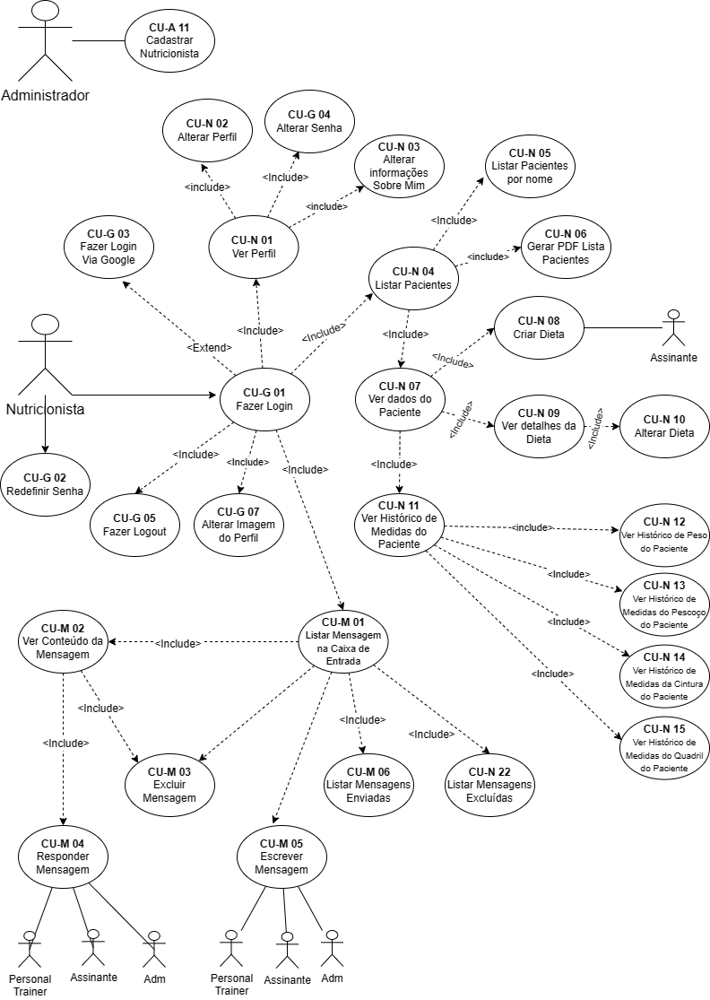

2. Personal Trainer
   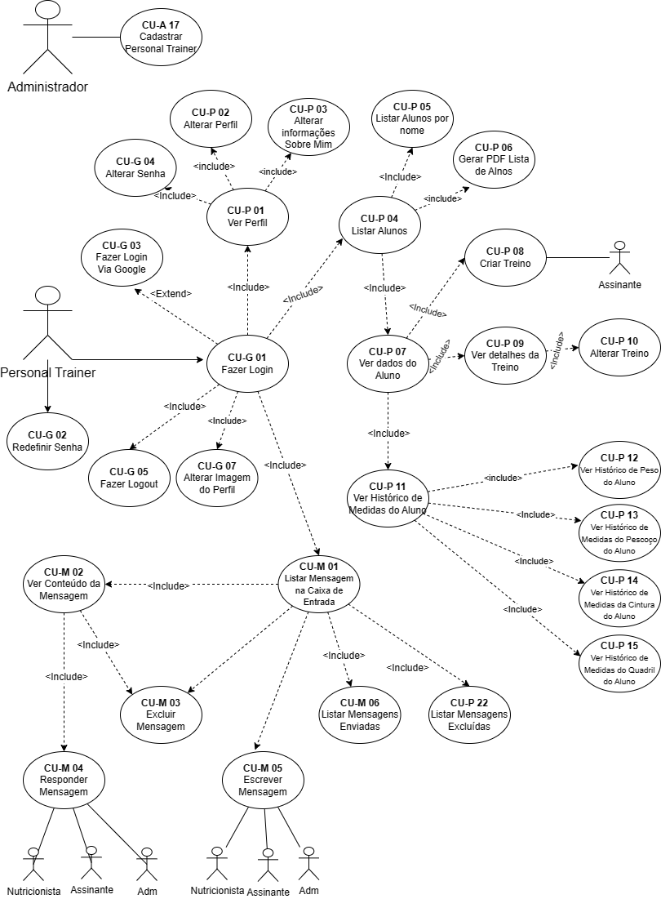

3. Assinante
   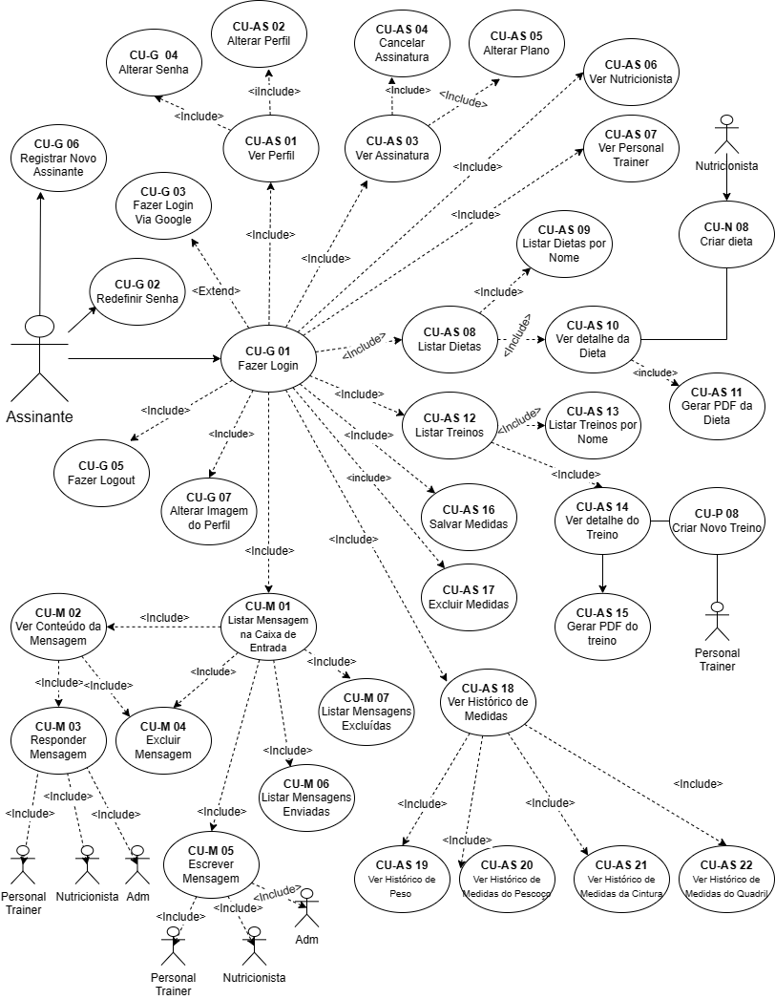

## Atores 
1. Administrador - Pessoa que irá manter os Planos, Assinantes, Nutricionistas e Personal Trainers, podendo realizar consultas, cadastros, alterações, bloqueios / desbloqueios, e envio de mensagens;
1. Nutricionista - Profissional certificado para criar plano alimentar personalizado, podendo realizar consultas, alterações e envio de mensagens;
1. Personal Trainer - Profissional certificado para criar plano de Treino personalizado, podendo realizar consultas, alterações e envio de mensagens;
1. Assinante - Pessoa que recebe o plano alimentar (Paciente) e o plano de treino (Aluno), podendo realizar consultas, alterações e envio de mensagens;

## Casos de Uso

1. Administrador

    1. CU-G 01 - Logar no Sistema: Administrador faz login no Sistema;
        * Ator Primário: Administrador;
        * Pré-condições: Administrador estar cadastrado para utilização do Sistema;
        * Fluxo Principal:
            1. O Administrador requisita acessar o Sistema;
            1. O Sistema apresenta a tela de login para que sejam inseridos o e-mail e a senha do Administrador;
            1. O Administrador fornece os dados;
            1. O Sistema faz a validação dos dados inseridos e, se forem válidos, loga o Administrador no Sistema;
        * Fluxo Alternativo: 
            1. O Administrador requisita acessar o Sistema através do Facebook – CU-G 02;
            1. O Administrador requisita acessar o Sistema através do Google – CU-G 03;
        * Fluxo de Exceção: Caso a senha ou login estejam incorretos, o Sistema apresenta uma mensagem de erro;
        * Pós-condições: O Administrador efetuou o login;

    1. CU-G 05 – Logout do Sistema: Administrador sai do Sistema;
        * Ator Primário: Administrador;
        * Pré-condições: Administrador estar logado no Sistema;
        * Fluxo Principal:
            1. O Administrador requisita “sair”;
            1. O Sistema faz o logout do Administrador;
            1. O Administrador é direcionado para a página home do site;
        * Pós-condições: O Administrador efetuou o Logout;

    1. CU-A 01 – Listar Assinantes: O Administrador verifica a lista de Assinantes cadastrados no Sistema; 
        * Ator Primário: Administrador;
        * Pré-condições: Administrador estar logado no Sistema;
        * Fluxo Principal:
            1. O Administrador requisita verificar no Sistema a lista de Assinantes cadastrados;
            1. O Sistema apresenta a lista de Assinantes cadastrados;
            1. O Sistema apresenta campo para listar Assinante pelo nome CU-A 02;
            1. O Sistema apresenta a opção de ver dados cadastrais do Assinante CU-A 03;
        * Fluxo Alternativo: 
            1. O Administrador informa o nome do Assinante no campo de pesquisa CU-A 02;
            1. O Sistema apresenta a lista de Assinantes cadastrados pelo nome informado;
            1. O Sistema apresenta a opção de ver dados cadastrais da lista de Assinantes cadastrados pelo nome informado CU-A 03;
        * Pós-condições: O Administrador visualizou a lista de Assinantes cadastrados;

    1. CU-A 03 – Ver dados cadastrais do Assinante: O Administrador verifica os dados cadastrais do Assinante;
        * Ator Primário: Administrador;
        * Pré-condições: 
            1. O Administrador estar logado no Sistema;
            1. O Administrador listar Assinantes cadastrados no Sistema CU-A 01;
        * Fluxo Principal:
            1. O Administrador requisita verificar no Sistema os dados cadastrais do Assinante;
            1. O Sistema apresenta os dados do Assinante (nome, e-mail e status) e dados do plano do Assinante (plano, valor, início e fim do plano);
            1. O Sistema apresenta a opção de bloquear ou desbloquear Assinante CU-A 04;
        * Pós-condições: O Administrador visualizou os dados do Assinante;

    1. CU-A 04 – Bloquear e Desbloquear Assinante: O Administrador bloqueia ou desbloqueia Assinante;
        * Ator Primário: Administrador;
        * Pré-condições: 
            1. O Administrador estar logado no Sistema;
            1. O Administrador listar Assinantes cadastrados no Sistema CU-A 01;
            1. O Administrador ver dados cadastrais do Assinante CU-A 03;
        * Fluxo Principal: O Administrador requisita bloquear ou desbloquear Assinante;
        * Pós-condições: O Administrador bloqueou ou desbloqueou Assinante;

    1. CU-A 05 – Listar Nutricionistas: O Administrador verifica a lista de Nutricionistas cadastrados no Sistema;
        * Ator Primário: Administrador;
        * Pré-condições: Administrador estar logado no Sistema;
        * Fluxo Principal:
            1.	O Administrador requisita verificar no Sistema a lista de Nutricionistas cadastrados;
            2.	O Sistema apresenta a lista de Nutricionistas cadastrados;
            3.	O Sistema apresenta campo listar Nutricionista pelo nome CU-A 06;
            4.	O Sistema apresenta a opção de bloquear ou desbloquear Nutricionista CU-A 07;
            5.	O Sistema apresenta a opção de cadastrar Nutricionista CU-A 08;
        * Fluxo Alternativo: 
            1.	O Administrador informa o nome do Nutricionista no campo de pesquisa CU-A 06;
            2.	O Sistema apresenta a lista de Nutricionistas cadastrados pelo nome informado;
            3.	O Sistema apresenta a opção de bloquear ou desbloquear Nutricionista CU-A 07;
            4.	O Sistema apresenta a opção de cadastrar Nutricionista CU-A 08;
        * Pós-condições: O Administrador visualizou a lista de Nutricionistas cadastrados;

    
    1. CU-A 07 – Bloquear e Desbloquear Nutricionista: O Administrador bloqueia ou desbloqueia Nutricionista;
        * Ator Primário: Administrador;
        * Pré-condições: 
            1.	O Administrador estar logado no Sistema;
            2.	O Administrador listar Nutricionistas cadastrados no Sistema CU-A 05;
        * Fluxo Principal: O Administrador requisita bloquear ou desbloquear Nutricionista;
        * Pós-condições: O Administrador bloqueou ou desbloqueou Nutricionista

    1. CU-A 08 – Cadastrar Nutricionista: O Administrador cadastra Nutricionista;
        * Ator Primário: Administrador;
        * Pré-condições: 
            1.	O Administrador estar logado no Sistema;
            2.	O Administrador listar Nutricionistas cadastrados no Sistema CU-A 05;
        * Fluxo Principal:
            1.	O Administrador requisita cadastrar Nutricionista;
            2.	O Sistema apresenta a tela de cadastro;
            3.	O Administrador fornece os dados solicitados (nome, e-mail, telefone e registro profissional) do Nutricionista e requisita salvar os dados;
            4.	O Sistema faz a validação dos dados inseridos e, se forem válidos, cadastra o Nutricionista;
        * Fluxo de exceção:
            1.	Caso os dados não sejam válidos, o Sistema apresenta uma mensa-gem de erro;
            2.	Caso já exista cadastro para o e-mail informado, o Sistema apresenta mensagem de erro;
        * Pós-condições: O Administrador cadastrou Nutricionista;

    1. CU-A 09 – Listar Personal Trainers: O Administrador verifica a lista de Personal Trainers cadastrados no Sistema
        * Ator Primário: Administrador;
        * Pré-condições: Administrador estar logado no Sistema;
        * Fluxo Principal:
            1.	O Administrador requisita verificar no Sistema a lista de Personal Trainers cadastrados;
            2.	O Sistema apresenta a lista de Personal Trainers cadastrados;
            3.	O Sistema apresenta campo para listar Personal Trainer pelo nome CU-A 10; 
            4.	O Sistema apresenta a opção de bloquear ou desbloquear Personal Trainer CU-A 11;
            5.	O Sistema apresenta a opção de cadastrar Personal Trainer CU-A 12;
        * Fluxo Alternativo: 
            1.	O Administrador informa o nome do Personal Trainer no campo de pesquisa CU-A 10;
            2.	O Sistema apresenta a lista de Personal Trainers cadastrados pelo nome informado;
            3.	O Sistema apresenta a opção de bloquear ou desbloquear Personal Trainer CU-A 11;
            4.	O Sistema apresenta a opção de cadastrar Personal Trainer CU-A 12;
        * Pós-condições: O Administrador visualizou a lista de Personal Trainers cadastrados;

    1. CU-A 11 – Bloquear e Desbloquear Personal Trainer: O Administrador bloqueia ou desbloqueia Personal Trainer;
        * Ator Primário: Administrador;
        * Pré-condições: 
            1.	O Administrador estar logado no Sistema;
            2.	O Administrador listar Personal Trainers cadastrados no Sistema CU-A 09;
        * Fluxo Principal: O Administrador requisita bloquear ou desbloquear Personal Trainer;
        * Pós-condições: O Administrador bloqueou ou desbloqueou Personal Trainer;

    1. CU-A 12 – Cadastrar Personal Trainer: O Administrador cadastra Personal Trainer;
        * Ator Primário: Administrador;
        * Pré-condições: 
            1.	O Administrador estar logado no Sistema;
            2.	O Administrador listar Personal Trainer cadastrados no Sistema CU-A 09;
        * Fluxo Principal:
            1.	O Administrador requisita cadastrar Personal Trainer;
            2.	O Sistema apresenta a tela de cadastro;
            3.	O Administrador fornece os dados solicitados (nome, e-mail, telefone e registro profissional) do Personal Trainer e requisita salvar os dados;
            4.	O Sistema faz a validação dos dados inseridos e, se forem válidos, ca-dastra o Personal Trainer;
        * Fluxo de exceção:
            1.	Caso os dados não sejam válidos, o Sistema apresenta uma mensa-gem de erro;
            2.	Caso já exista cadastro para o e-mail informado, o Sistema apresenta mensagem de erro;
        * Pós-condições: O Administrador cadastrou Personal Trainer;

    1. CU-A 13 – Listar Planos: O Administrador verifica a lista de planos cadastrados;
        * Ator Primário: Administrador;
        * Pré-condições: O Administrador estar logado no Sistema;
        * Fluxo Principal: 
            1.	O Administrador requisita verificar no Sistema a lista de mensagens da caixa de entrada;
            2.	O Sistema apresenta a lista mensagens da caixa de entrada; 
            3.	O Sistema apresenta campo para listar planos pelo nome CU-A 14;
            4.	O Sistema apresenta a opção de ver dados do plano CU-A 15;
            5.	O Sistema apresenta a opção de cadastrar plano CU-A 17;
        * Fluxo Alternativo: 
            1.	O Administrador informa o nome do plano no campo de pesquisa CU-A 14;
            2.	O Sistema apresenta a lista de planos cadastrados pelo nome informa-do;
            3.	O Sistema apresenta a opção de ver dados cadastrais da lista de planos cadastrados pelo nome informado CU-A 15;
            4.	O Sistema apresenta a opção de cadastrar plano CU-A 17;
        * Pós-condições: O Administrador visualizou a lista de planos cadastrados;

    1. CU-A 15 – Ver dados do Plano: O Administrador verifica os dados cadastrais do plano;
        * Ator Primário: Administrador;
        * Pré-condições: 
            1.	O Administrador estar logado no Sistema;
            2.	O Administrador listar planos cadastrados no Sistema CU-A 13;
        * Fluxo Principal:
            1.	O Administrador requisita verificar no Sistema os dados cadastrais do plano;
            2.	O Sistema apresenta os dados do plano (plano, valor, status e descrição);
            3.	O Sistema apresenta a opção de alterar dados do plano CU-A 16;
        * Pós-condições: O Administrador visualizou os dados do plano;

    1. CU-A 16 – Salvar alterações dos dados do Plano: O Administrador altera dados do plano;
        * Ator Primário: Administrador;
        * Pré-condições: 
            1.	O Administrador estar logado no Sistema;
            2.	O Administrador listar planos cadastrados no Sistema CU-A 13;
            3.	O Administrador ver dados cadastrais do plano CU-A 15;
        * Fluxo Principal:
            1.	O Administrador requisita alterar dados cadastrais do plano;
            2.	O Sistema apresenta a tela de cadastro;
            3.	O Administrador fornece os dados solicitados (plano, valor, status e descrição) do plano e requisita salvar os dados;
            4.	O Sistema faz a validação dos dados inseridos e, se forem válidos, altera o plano;
        * Fluxo de exceção: Caso os dados não sejam válidos, o Sistema apresenta uma mensagem de erro;
        * Pós-condições: O Administrador alterou os dados do plano;

    1. CU-A 17 – Cadastrar Plano: O Administrador cadastra plano;
        * Ator Primário: Administrador;
        * Pré-condições: 
            1.	O Administrador estar logado no Sistema;
            2.	O Administrador listar planos cadastrados no Sistema CU-A 13;
        * Fluxo Principal:
            1.	O Administrador requisita cadastrar plano;
            2.	O Sistema apresenta a tela de cadastro;
            3.	O Administrador fornece os dados solicitados (plano, valor, status e descrição) do plano e requisita salvar os dados;
            4.	O Sistema faz a validação dos dados inseridos e, se forem válidos, cadastra o plano;
        * Fluxo de exceção: Caso os dados não sejam válidos, o Sistema apresenta uma mensagem de erro;
        * Pós-condições: O Administrador cadastrou plano;

    1. CU-A 18 – Listar mensagens na Caixa de Entrada: O Administrador lista as mensagens da caixa de entrada;
        * Ator Primário: Administrador;
        * Pré-condições: O Administrador estar logado no Sistema;
        * Fluxo Principal:
            1.	O Administrador requisita verificar no Sistema a lista de mensagens;
            2.	O Sistema apresenta a lista de mensagens da caixa de entrada;
            3.	O Sistema apresenta a opção de ver conteúdo da mensagem CU-A 19;
            4.	O Sistema apresenta a opção de responder mensagem CU-A 20;
            5.	O Sistema apresenta a opção de excluir mensagem CU-A 21;
            6.	O Sistema apresenta a opção de escrever mensagem CU-A 22;
            7.	O Sistema apresenta a opção de listar mensagens enviadas CU-A 23;
            8.	O Sistema apresenta a opção de listar mensagens excluídas CU-A 24;
        * Pós-condições: O Administrador visualizou as mensagens da caixa de entrada;

    1. CU-A 19 – Ver conteúdo da mensagem: O Administrador visualiza o conteúdo da mensagem;
        * Ator Primário: Administrador;
        * Pré-condições:
            1.	O Administrador estar logado no Sistema;
            2.	O Administrador listar mensagem na caixa de entrada
        * Fluxo Principal:
            1.	O Administrador requisita verificar o conteúdo da mensagem;
            2.	O Sistema apresenta tela com o conteúdo da mensagem;
            3.	O Sistema apresenta a opção de responder mensagem CU-A 20; 
            4.	O Sistema apresenta a opção de excluir mensagem CU-A 21;
        * Pós-condições: O Administrador visualizou as mensagens da caixa de entrada;

    1. CU-A 20 – Responder mensagem: O Administrador responde à mensagem;
        * Ator Primário: Administrador;
        * Ator Secundário:
            1.	Nutricionista;
            2.	Personal Trainer;
            3.	Assinante;
        * Pré-condições:
            1.	O Administrador estar logado no Sistema;
            2.	O Administrador listar mensagem na caixa de entrada;
            3.	O Administrador requisitar verificar o conteúdo da mensagem;
        * Fluxo Principal:
            1.	O Administrador requisita responder mensagem;
            2.	O Sistema apresenta a tela para escrever o conteúdo da resposta;
            3.	O Administrador fornece o conteúdo da resposta da mensagem; 
            4.	O Administrador requisita enviar a resposta da mensagem;
            5.	O Sistema faz a validação dos dados inseridos e, se forem válidos, envia a resposta da mensagem;
            6.	O Sistema fecha a tela de resposta;
        * Fluxo de exceção: Caso os dados não sejam válidos, o Sistema apresenta uma mensagem de erro;
        * Pós-condições: O Administrador respondeu uma mensagem;

    1. CU-A 21 – Excluir mensagem: O Administrador exclui mensagem;
        * Ator Primário: Administrador;
        * Pré-condições:
            1.	O Administrador estar logado no Sistema;
            2.	O Administrador listar mensagem na caixa de entrada;
            3.	O Administrador verificar o conteúdo da mensagem;
        * Fluxo Principal:
            1.	O Administrador requisita listar mensagem na caixa de entrada;
            2.	O Administrador requisita excluir mensagem;
            3.	O Sistema direciona a mensagem excluída para “Mensagens Excluídas”;
        * Fluxo Alternativo: 
            1.	O Administrador requisita ver conteúdo da mensagem;
            2.	O Administrador requisita excluir mensagem;
            3.	O Sistema direciona a mensagem excluída para “Mensagens Excluídas”;
            4.	O Sistema fecha a tela de ver conteúdo da mensagem
        * Pós-condições: O Administrador excluiu mensagem;

    1. CU-A 22 – Escrever mensagem: O Administrador escreve mensagem;
        * Ator Primário: Administrador;
        * Ator Secundário:
            1.	Nutricionista;
            2.	Personal Trainer;
            3.	Assinante;
        * Pré-condições:
            1.	O Administrador estar logado no Sistema;
            2.	O Administrador listar mensagem na caixa de entrada;
        * Fluxo Principal:
            1.	O Administrador requisita escrever mensagem;
            2.	O Sistema apresenta a tela para escrever mensagem;
            3.	O Administrador fornece os dados solicitados (destinatário, assunto e mensagem);
            4.	O Administrador requisita enviar a mensagem;
            5.	O Sistema faz a validação dos dados inseridos e, se forem válidos, envia a mensagem;
            6.	O Sistema fecha a tela de escrever mensagem;
        * Fluxo de exceção: Caso os dados não sejam válidos, o Sistema apresenta uma mensagem de erro;
        * Pós-condições: O Administrador enviou mensagem;

    1. CU-A 23 – Listar Mensagens Enviadas: O Administrador lista mensagens enviadas;
        * Ator Primário: Administrador;
        * Pré-condições:
            1.	O Administrador estar logado no Sistema;
            2.	O Administrador listar mensagem na caixa de entrada;
        * Fluxo Principal:
            1.	O Administrador requisita listar mensagens enviadas;
            2.	O Sistema apresenta a lista de mensagens enviadas;
            3.	O Sistema apresenta a opção e ver conteúdo da mensagem CU-A 19;
        * Pós-condições: O Administrador listou mensagens enviadas;

    1. CU-A 24 – Listar Mensagens Excluídas: O Administrador lista mensagens excluídas;
        * Ator Primário: Administrador;
        * Pré-condições:
            1.	O Administrador estar logado no Sistema;
            2.	O Administrador listar mensagem na caixa de entrada;
        * Fluxo Principal:
            1.	O Administrador requisita listar mensagens excluídas;
            2.	O Sistema apresenta a lista de mensagens excluídas;
            3.	O Sistema apresenta a opção e ver conteúdo da mensagem CU-A 19;
        * Pós-condições: O Administrador listou mensagens excluídas;

1. Nutricionista

    1. CU-G 01 - Logar no Sistema: Nutricionista faz login no Sistema;
        * Ator Primário: Nutricionista;
        * Pré-condições: Nutricionista estar cadastrado para utilização do Sistema e não estar bloqueado;
        * Fluxo Principal:
            1.	O Nutricionista requisita acessar o Sistema;
            2.	O Sistema apresenta a tela de login para que sejam inseridos o login e a senha do Nutricionista e as opções de login via Facebook ou de login via Google;
            3.	O Nutricionista fornece os dados (e-mail e senha);
            4.	O Sistema faz a validação dos dados inseridos e, se forem válidos, loga o Nutricionista no Sistema;
        * Fluxo Alternativo: 
            1.	O Nutricionista requisita acessar o Sistema através do Facebook – CU-G 02;
            2.	O Nutricionista requisita acessar o Sistema através do Google – CU-G 03;
        * Fluxo de Exceção: Caso a senha ou login estejam incorretos, o Sistema apresenta uma mensagem de erro;
        * Pós-condições: O Nutricionista efetuou o login;

    1. CU-G 04 – Redefinir Senha: Nutricionista redefini a senha de acesso ao Sistema;
        * Ator Primário: Nutricionista;
        * Pré-condições: Nutricionista estar cadastrado para utilização do Sistema e não estar bloqueado;
        * Fluxo Principal:
            1.	O Nutricionista requisita “Esqueci minha senha”;
            2.	O Sistema apresenta a tela de redefinir senha para que seja inserido o e-mail do Nutricionista;
            3.	O Nutricionista fornece os dados;
            4.	O Sistema faz a validação dos dados inseridos e, se forem válidos, en-via um e-mail, para o Nutricionista, com um link para criar a senha;
            5.	Após definir a nova senha, o Nutricionista é direcionado para a tela de login – CU-G 01
        * Pós-condições: O Nutricionista redefiniu a senha;

    1. CU-G 05 – Logout do Sistema: Nutricionista sai do Sistema;
        * Ator Primário: Nutricionista;
        * Pré-condições: Nutricionista estar logado no Sistema;
        * Fluxo Principal:
            1.	O Nutricionista requisita “sair”;
            2.	O Sistema faz o logout do Nutricionista;
            3.	O Nutricionista é direcionado para a página home do site;
        * Pós-condições: O Nutricionista efetuou o Logout;

    1. CU-N 01 – Ver Perfil: Nutricionista ver perfil;
        * Ator Primário: Nutricionista;
        * Pré-condições: Nutricionista estar logado no Sistema;
        * Fluxo Principal:
            1.	O Nutricionista requisita ver perfil;
            2.	O Sistema apresente a tela de perfil do Nutricionista;
            3.	O Sistema apresenta a opção de salvar alterações do perfil CU-N 02;
            4.	O Sistema apresenta a opção de alterar a senha CU-N 03;
        * Pós-condições: O Nutricionista verificou o perfil;

    1. CU-N 02 – Salvar alterações dos dados do Perfil: O Nutricionista altera dados do perfil;
        * Ator Primário: Nutricionista;
        * Pré-condições: 
            1.	O Nutricionista estar logado no Sistema;
            2.	O Nutricionista ver perfil CU-N 01;
        * Fluxo Principal:
            1.	O Nutricionista fornece os dados a serem alterados (telefone e descrição “sobre mim”);
            2.	O Nutricionista requisita salvar as alterações;
            3.	O Sistema faz a validação dos dados inseridos e, se forem válidos, altera-os;
        * Fluxo de exceção: Caso os dados não sejam válidos, o Sistema apresenta uma mensagem de erro;
        * Pós-condições: O Nutricionista alterou os dados do perfil;

    1. CU-N 03 – Alterar Senha: O Nutricionista altera a senha de acesso ao Sistema;
        * Ator Primário: Nutricionista;
        * Pré-condições: 
        1.	O Nutricionista estar logado no Sistema;
        2.	O Nutricionista ver perfil CU-N 01;
        * Fluxo Principal:
            1.	O Nutricionista fornece a senha atual e a nova senha;
            2.	O Nutricionista requisita alterar senha;
            3.	O Sistema faz a validação dos dados inseridos e, se forem válidos, altera a senha atual para a nova senha;
        * Fluxo de exceção: Caso os dados não sejam válidos, o Sistema apresenta uma mensagem de erro;
        * Pós-condições: O Nutricionista alterou a senha de acesso ao Sistema;

    1. CU-N 04 – Listar Pacientes: O Nutricionista verifica a lista de Pacientes; 
        * Ator Primário: Nutricionista;
        * Pré-condições: Nutricionista estar logado no Sistema;
        * Fluxo Principal:
            1.	O Nutricionista requisita verificar no Sistema a lista de Pacientes;
            2.	O Sistema apresenta a lista de Pacientes;
            3.	O Sistema apresenta campo para listar Pacientes pelo nome CU-N 05;
            4.	O Sistema apresenta a opção de ver dados do Paciente CU-N 06;
        * Fluxo Alternativo: 
            1.	O Nutricionista informa o nome do Paciente no campo de pesquisa CU-N 05;
            2.	O Sistema apresenta a lista de Pacientes pelo nome informado;
            3.	O Sistema apresenta a opção de ver dados do Paciente da lista de Pacientes cadastrados pelo nome informado CU-N 06;
        * Pós-condições: O Nutricionista visualizou a lista de Pacientes;

    1. CU-N 06 – Ver dados do Paciente: O Nutricionista verifica os dados do Paciente;
        * Ator Primário: Nutricionista;
        * Pré-condições: 
            1.	O Nutricionista estar logado no Sistema;
            2.	O Nutricionista listar Pacientes CU-N 04;
        * Fluxo Principal:
            1.	O Nutricionista requisita verificar no Sistema os dados do Paciente;
            2.	O Sistema apresenta os dados do Paciente (nome, objetivo, idade, altura, peso, medida do pescoço, medida da cintura, medida do quadril e IMC), ver histórico de dietas CU-N 07, ver detalhes da dieta CU-N 08, criar dieta CU-N 10 e ver histórico de medidas do Paciente CU-N 11;
        * Pós-condições: O Nutricionista visualizou os dados do Paciente;

    1. CU-N 07 – Ver detalhes da dieta: O Nutricionista verifica o histórico de die-tas do Paciente;
        * Ator Primário: Nutricionista;
        * Pré-condições: 
            1.	O Nutricionista estar logado no Sistema;
            2.	O Nutricionista listar Pacientes CU-N 04;
            3.	O Nutricionista ver dados do Paciente CU-N 06;
        * Fluxo Principal:
            1.	O Nutricionista requisita ver detalhes na dieta atual do Paciente;
            2.	O Sistema apresenta os detalhes da dieta atual do Paciente;
            3.	O Sistema apresenta opção de incluir item na dieta atual do Paciente CU-N 08;
            4.	O Sistema apresenta opção de editar item existente na dieta atual do Paciente CU-N 09;
            5.	O Sistema apresenta opção de excluir item na dieta atual do Paciente CU-N 10;
            6.	O Sistema apresenta a opção de salvar alterações na dieta atual do Paciente CU-N 11
        * Fluxo Alternativo:
            1.	O Nutricionista requisita ver detalhes da dieta no histórico de dietas do Paciente apresentado pelo Sistema;
            2.	O Sistema apresenta os detalhes da dieta;
        * Pós-condições: O Nutricionista visualizou detalhes da dieta do Paciente;

    1. CU-N 08 – Incluir item na dieta: O Nutricionista inclui item na dieta atual do Paciente;
        * Ator Primário: Nutricionista;
        * Pré-condições: 
            1.	O Nutricionista estar logado no Sistema;
            2.	O Nutricionista listar Pacientes CU-N 04;
            3.	O Nutricionista ver dados do Paciente CU-N 06;
            4.	O Nutricionista ver detalhes da dieta atual do Paciente CU-N 07;
        * Fluxo Principal:
            1.	O Nutricionista requisita incluir item na dieta atual do Paciente;
            2.	O Sistema apresenta caixa de texto para a descrição do item;
            3.	O Nutricionista fornece a descrição do item e requisita salvar os dados alterados CU-N 11;
        * Fluxo de exceção: Caso os dados não sejam válidos, o Sistema apresenta uma mensagem de erro;
        * Pós-condições: O Nutricionista incluiu item na dieta atual do Paciente;

    1. CU-N 09 – Editar item na dieta: O Nutricionista edita item na dieta atual do Paciente;
        * Ator Primário: Nutricionista;
        * Pré-condições: 
            1.	O Nutricionista estar logado no Sistema;
            2.	O Nutricionista listar Pacientes CU-N 04;
            3.	O Nutricionista ver dados do Paciente CU-N 06;
            4.	O Nutricionista ver detalhes da dieta atual do Paciente CU-N 07;
        * Fluxo Principal:
            1.	O Nutricionista requisita no item da dieta atual do Paciente para editar a descrição;
            2.	O Nutricionista fornece a descrição do item e requisita salvar os dados alterados CU-N 11;
        * Fluxo de exceção: Caso os dados não sejam válidos, o Sistema apresenta uma mensagem de erro;
        * Pós-condições: O Nutricionista editou item na dieta atual do Paciente;

    1. CU-N 10 – Excluir item na dieta: O Nutricionista exclui item na dieta atual do Paciente;
        * Ator Primário: Nutricionista;
        * Pré-condições: 
            1.	O Nutricionista estar logado no Sistema;
            2.	O Nutricionista listar Pacientes CU-N 04;
            3.	O Nutricionista ver dados do Paciente CU-N 06;
            4.	O Nutricionista ver detalhes da dieta atual do Paciente CU-N 07;
        * Fluxo Principal:
            1.	O Nutricionista requisita excluir item da dieta atual do Paciente;
            2.	O Sistema exclui o item;
            3.	O Nutricionista requisita salvar os dados alterados CU-N 11;
        * Pós-condições: O Nutricionista excluiu item na dieta atual do Paciente;

    1. CU-N 11 – Salvar alterações na dieta: O Nutricionista salva alterações na dieta atual do Paciente;
        * Ator Primário: Nutricionista;
        * Pré-condições: 
            1.	O Nutricionista estar logado no Sistema;
            2.	O Nutricionista listar Pacientes CU-N 04;
            3.	O Nutricionista ver dados do Paciente CU-N 06;
            4.	O Nutricionista ver detalhes da dieta atual do Paciente CU-N 07;
        * Fluxo Principal:
            1.	O Nutricionista requisita salvar alterações na dieta atual do Paciente;
            2.	O Sistema faz a validação dos dados inseridos e, se forem válidos, salva as alterações na dieta atual do Paciente;
        * Fluxo de exceção: Caso os dados não sejam válidos, o Sistema apresenta uma mensagem de erro;
        * Pós-condições: O Nutricionista salvou alterações na dieta atual do Paciente;

    1. CU-N 12 – Criar Dieta: O Nutricionista cria dieta;
        * Ator Primário: Nutricionista;
        * Pré-condições: 
            1.	O Nutricionista estar logado no Sistema;
            2.	O Nutricionista listar Pacientes CU-N 04;
            3.	O Nutricionista ver dados do Paciente CU-N 06;
        * Fluxo Principal:
            1.	O Nutricionista requisita criar dieta;
            2.	O Sistema apresenta a tela de cadastro de dieta;
            3.	O Nutricionista fornece os dados solicitados (nome da dieta, data de início e fim, objetivo);
            4.	O Sistema apresenta a opção de incluir item na dieta CU-N 08;
            5.	O Sistema apresenta a opção de editar item na dieta CU-N 09;
            6.	O Sistema apresenta a opção de excluir item na dieta CU-N 10;
            7.	O Sistema apresenta a opção de salvar alterações na dieta CU-N 11;
        * Fluxo de Alternativo: 
            1.	O Sistema apresenta a opção de editar item na dieta CU-N 09;
            2.	O Sistema apresenta a opção de excluir item na dieta CU-N 10;
            3.	O Sistema apresenta a opção de salvar alterações na dieta CU-N 11;
        * Pós-condições: O Nutricionista criou dieta;

    1. CU-N 13 – Ver histórico de medidas do Paciente: O Nutricionista verifica o histórico de medidas do Paciente;
        * Ator Primário: Nutricionista;
        * Pré-condições: 
            1.	O Nutricionista estar logado no Sistema;
            2.	O Nutricionista listar Pacientes CU-N 04;
            3.	O Nutricionista ver dados do Paciente CU-N 06;
        * Fluxo Principal:
            1.	O Nutricionista requisita ver histórico de medidas do Paciente;
            2.	O Sistema apresenta o gráfico com histórico de medidas de peso do Paciente CU-N 14;
            3.	O Sistema apresenta a opção de gerar arquivo PDF com histórico de medidas do Paciente CU-N 19;
        * Fluxo Alternativo:
            1.	O Nutricionista requisita ver histórico de medidas do pescoço do Paciente CU-N 15;
            2.	O Nutricionista requisita ver histórico de medidas da cintura do Paciente CU-N 16;
            3.	O Nutricionista requisita ver histórico de medidas do quadril do Paciente CU-N 17;
            4.	O Nutricionista requisita ver histórico de medidas do IMC do Paciente CU-N 18;
        * Pós-condições: O Nutricionista visualizou o histórico de medidas do Pacien-te;

    1. CU-N 19 – Gerar PDF do histórico de medidas do Paciente: O Nutricionista gera arquivo PDF com histórico de medidas do Paciente;
        * Ator Primário: Nutricionista;
        * Pré-condições: 
            1.	O Nutricionista estar logado no Sistema;
            2.	O Nutricionista listar Pacientes CU-N 04;
            3.	O Nutricionista ver dados do Paciente CU-N 06;
            4.	O Nutricionista ver histórico de medidas do Paciente CU-N 13;
        * Fluxo Principal:
            1.	O Nutricionista requisita gerar arquivo PDF com histórico de medidas do Paciente;
            2.	O Sistema gera arquivo em PDF com histórico de medidas do Pacien-te;
        * Pós-condições: O Nutricionista gerou arquivo PDF com histórico de medidas do Paciente;

    1. CU-N 20 – Listar mensagens na Caixa de Entrada: O Nutricionista lista as mensagens da caixa de entrada;
        * Ator Primário: Nutricionista;
        * Pré-condições: O Nutricionista estar logado no Sistema;
        * Fluxo Principal:
            1.	O Nutricionista requisita verificar a lista de mensagens;
            2.	O Sistema apresenta a lista de mensagens da caixa de entrada;
            3.	O Sistema apresenta a opção de ver conteúdo da mensagem CU-N 21;
            4.	O Sistema apresenta a opção de excluir mensagem CU-N 22;
            5.	O Sistema apresenta a opção de responder mensagem CU-N 23;
            6.	O Sistema apresenta a opção de escrever mensagem CU-N 24;
            7.	O Sistema apresenta a opção de listar mensagens enviadas CU-N 25;
            8.	O Sistema apresenta a opção de listar mensagens excluídas CU-N 26;
        * Pós-condições: O Nutricionista visualizou as mensagens da caixa de entra-da;

    1. CU-N 21 – Ver conteúdo da mensagem: O Nutricionista visualiza o conteúdo da mensagem;
        * Ator Primário: Nutricionista;
        * Pré-condições:
            1.	O Nutricionista estar logado no Sistema;
            2.	O Nutricionista listar mensagem na caixa de entrada;
        * Fluxo Principal:
            1.	O Nutricionista requisita verificar o conteúdo da mensagem;
            2.	O Sistema apresenta tela com o conteúdo da mensagem;
            3.	O Sistema apresenta a opção de responder mensagem CU-N 23; 
            4.	O Sistema apresenta a opção de excluir mensagem CU-N 22;
        * Pós-condições: O Nutricionista visualizou as mensagens da caixa de entrada;

    1. CU-N 22 – Responder mensagem: O Nutricionista responde à mensagem;
        * Ator Primário: Nutricionista;
        * Ator Secundário:
            1.	Administrador;
            2.	Personal Trainer;
            3.	Assinante;
        * Pré-condições:
            1.	O Nutricionista estar logado no Sistema;
            2.	O Nutricionista listar mensagem na caixa de entrada;
            3.	O Nutricionista requisitar verificar o conteúdo da mensagem;
        * Fluxo Principal:
            1.	O Nutricionista requisita responder mensagem;
            2.	O Sistema apresenta a tela para escrever o conteúdo da resposta;
            3.	O Nutricionista fornece o conteúdo da resposta da mensagem; 
            4.	O Nutricionista requisita enviar a resposta da mensagem;
            5.	O Sistema faz a validação dos dados inseridos e, se forem válidos, envia a resposta da mensagem;
            6.	O Sistema fecha a tela de resposta;
        * Fluxo de exceção: Caso os dados não sejam válidos, o Sistema apresenta uma mensagem de erro;
        * Pós-condições: O Nutricionista respondeu uma mensagem;

    1. CU-N 23 – Excluir mensagem: O Nutricionista exclui mensagem;
        * Ator Primário: Nutricionista;
        * Pré-condições:
            1.	O Nutricionista estar logado no Sistema;
            2.	O Nutricionista listar mensagem na caixa de entrada;
            3.	O Nutricionista verificar o conteúdo da mensagem;
        * Fluxo Principal:
            1.	O Nutricionista requisita listar mensagem na caixa de entrada;
            2.	O Nutricionista requisita excluir mensagem;
            3.	O Sistema direciona a mensagem excluída para “Mensagens Excluídas”;
        * Fluxo Alternativo: 
            1.	O Nutricionista requisita ver conteúdo da mensagem;
            2.	O Nutricionista requisita excluir mensagem;
            3.	O Sistema direciona a mensagem excluída para “Mensagens Excluídas”;
            4.	O Sistema fecha a tela de ver conteúdo da mensagem
        * Pós-condições: O Nutricionista excluiu mensagem;

    1. CU-N 24 – Escrever mensagem: O Nutricionista escreve mensagem;
        * Ator Primário: Nutricionista;
        * Ator Secundário:
            1.	Administrador;
            2.	Personal Trainer;
            3.	Assinante;
        * Pré-condições:
            1.	O Nutricionista estar logado no Sistema;
            2.	O Nutricionista listar mensagem na caixa de entrada;
        * Fluxo Principal:
            1.	O Nutricionista requisita escrever mensagem;
            2.	O Sistema apresenta a tela para escrever mensagem;
            3.	O Nutricionista fornece os dados solicitados (destinatário, assunto e mensagem);
            4.	O Nutricionista requisita enviar a mensagem;
            5.	O Sistema faz a validação dos dados inseridos e, se forem válidos, envia a mensagem;
            6.	O Sistema fecha a tela de escrever mensagem;
        * Fluxo de exceção: Caso os dados não sejam válidos, o Sistema apresenta uma mensagem de erro;
        * Pós-condições: O Nutricionista enviou mensagem;

    1. CU-N 25 – Listar Mensagens Enviadas: O Nutricionista lista mensagens enviadas;
        * Ator Primário: Nutricionista;
        * Pré-condições:
            1.	O Nutricionista estar logado no Sistema;
            2.	O Nutricionista listar mensagem na caixa de entrada;
        * Fluxo Principal:
            1.	O Nutricionista requisita listar mensagens enviadas;
            2.	O Sistema apresenta a lista de mensagens enviadas;
            3.	O Sistema apresenta a opção e ver conteúdo da mensagem CU-N 21;
        * Pós-condições: O Nutricionista listou mensagens enviadas;

    1. CU-N 26 – Listar Mensagens Excluídas: O Nutricionista lista mensagens excluídas;
        * Ator Primário: Nutricionista;
        * Pré-condições:
            1.	O Nutricionista estar logado no Sistema;
            2.	O Nutricionista listar mensagem na caixa de entrada;
        * Fluxo Principal:
            1.	O Nutricionista requisita listar mensagens excluídas;
            2.	O Sistema apresenta a lista de mensagens excluídas;
            3.	O Sistema apresenta a opção e ver conteúdo da mensagem CU-N 21;
        * Pós-condições: O Nutricionista listou mensagens excluídas;

1. Personal Trainer

    1. CU-G 01 - Logar no Sistema: Personal Trainer faz login no Sistema;
        * Ator Primário: Personal Trainer;
        * Pré-condições: Personal Trainer estar cadastrado para utilização do Sistema e não estar bloqueado;
        * Fluxo Principal:
            1.	O Personal Trainer requisita acessar o Sistema;
            2.	O Sistema apresenta a tela de login para que sejam inseridos o login e a senha do Personal Trainer e as opções de login via Facebook ou de login via Google;
            3.	O Personal Trainer fornece os dados (e-mail e senha);
            4.	O Sistema faz a validação dos dados inseridos e, se forem válidos, loga o Personal Trainer no Sistema;
        * Fluxo Alternativo: 
            1.	O Personal Trainer requisita acessar o Sistema através do Facebook – CU-G 02;
            2.	O Personal Trainer requisita acessar o Sistema através do Google – CU-G 03;
        * Fluxo de Exceção: Caso a senha ou login estejam incorretos, o Sistema apresenta uma mensagem de erro;
        * Pós-condições: O Personal Trainer efetuou o login;

    1. CU-G 04 – Redefinir Senha: Personal Trainer redefini a senha de acesso ao Sistema;
        * Ator Primário: Personal Trainer;
        * Pré-condições: Personal Trainer estar cadastrado para utilização do Sistema e não estar bloqueado;
        * Fluxo Principal:
            1.	O Personal Trainer requisita “Esqueci minha senha”;
            2.	O Sistema apresenta a tela de redefinir senha para que seja inserido o e-mail do Personal Trainer;
            3.	O Personal Trainer fornece os dados;
            4.	O Sistema faz a validação dos dados inseridos e, se forem válidos, envia um e-mail, para o Personal Trainer, com um link para criar a senha;
            5.	Após definir a nova senha, o Personal Trainer é direcionado para a tela de login – CU-G 01
        * Pós-condições: O Personal Trainer redefiniu a senha;

    1. CU-G 05 – Logout do Sistema: Personal Trainer sai do Sistema;
        * Ator Primário: Personal Trainer;
        * Pré-condições: Personal Trainer estar logado no Sistema;
        * Fluxo Principal:
            1.	O Personal Trainer requisita “sair”;
            2.	O Sistema faz o logout do Personal Trainer;
            3.	O Personal Trainer é direcionado para a página home do site;
        * Pós-condições: O Personal Trainer efetuou o Logout;

    1. CU-P 01 – Ver Perfil: Personal Trainer ver perfil;
        * Ator Primário: Personal Trainer;
        * Pré-condições: Personal Trainer estar logado no Sistema;
        * Fluxo Principal:
            1.	O Personal Trainer requisita ver perfil;
            2.	O Sistema apresente a tela de perfil do Personal Trainer;
            3.	O Sistema apresenta a opção de salvar alterações do perfil CU-P 02;
            4.	O Sistema apresenta a opção de alterar a senha CU-P 03;
        * Pós-condições: O Personal Trainer verificou o perfil;

    1. CU-P 02 – Salvar alterações dos dados do Perfil: O Personal Trainer altera dados do perfil;
        * Ator Primário: Personal Trainer;
        * Pré-condições: 
            1.	O Personal Trainer estar logado no Sistema;
            2.	O Personal Trainer ver perfil CU-P 01;
        * Fluxo Principal:
            1.	O Personal Trainer fornece os dados a serem alterados (telefone e descrição “sobre mim”);
            2.	O Personal Trainer requisita salvar as alterações;
            3.	O Sistema faz a validação dos dados inseridos e, se forem válidos, altera-os;
        * Fluxo de exceção: Caso os dados não sejam válidos, o Sistema apresenta uma mensagem de erro;
        * Pós-condições: O Personal Trainer alterou os dados do perfil;

    1. CU-P 03 – Alterar Senha: O Personal Trainer altera a senha de acesso ao Sistema;
        * Ator Primário: Personal Trainer;
        * Pré-condições: 
            1.	O Personal Trainer estar logado no Sistema;
            2.	O Personal Trainer ver perfil CU-P 01;
        * Fluxo Principal:
            1.	O Personal Trainer fornece a senha atual e a nova senha;
            2.	O Personal Trainer requisita alterar senha;
            3.	O Sistema faz a validação dos dados inseridos e, se forem válidos, altera a senha atual para a nova senha;
        * Fluxo de exceção: Caso os dados não sejam válidos, o Sistema apresenta uma mensagem de erro;
        * Pós-condições: O Personal Trainer alterou a senha de acesso ao Sistema;

    1. CU-P 04 – Listar Alunos: O Personal Trainer verifica a lista de Alunos; 
        * Ator Primário: Personal Trainer;
        * Pré-condições: Personal Trainer estar logado no Sistema;
        * Fluxo Principal:
            1.	O Personal Trainer requisita verificar no Sistema a lista de Alunos;
            2.	O Sistema apresenta a lista de Alunos;
            3.	O Sistema apresenta campo para listar Alunos pelo nome CU-P 05;
            4.	O Sistema apresenta a opção de ver dados do Aluno CU-P 06;
        * Fluxo Alternativo: 
            1.	O Personal Trainer informa o nome do Aluno no campo de pesquisa CU-P 05;
            2.	O Sistema apresenta a lista de Alunos pelo nome informado;
            3.	O Sistema apresenta a opção de ver dados do Aluno da lista de Alunos cadastrados pelo nome informado CU-P 06;
        * Pós-condições: O Personal Trainer visualizou a lista de Alunos;

    1. CU-P 06 – Ver dados do Aluno: O Personal Trainer verifica os dados do Aluno;
        * Ator Primário: Personal Trainer;
        * Pré-condições: 
            1.	O Personal Trainer estar logado no Sistema;
            2.	O Personal Trainer listar Alunos CU-P 04;
        * Fluxo Principal:
            1.	O Personal Trainer requisita verificar no Sistema os dados do Aluno;
            2.	O Sistema apresenta os dados do Aluno (nome, objetivo, idade, altura, peso, medida do pescoço, medida da cintura, medida do quadril e IMC), ver histórico de treinos CU-P 07, ver detalhes do treino CU-P 08, criar treino CU-P 10 e ver histórico de medidas do Aluno CU-P 11;
        * Pós-condições: O Personal Trainer visualizou os dados do Aluno;

    1. CU-P 07 – Ver detalhes do treino: O Personal Trainer verifica o histórico de treinos do Aluno;
        * Ator Primário: Personal Trainer;
        * Pré-condições: 
            1.	O Personal Trainer estar logado no Sistema;
            2.	O Personal Trainer listar Alunos CU-P 04;
            3.	O Personal Trainer ver dados do Aluno CU-P 06;
        * Fluxo Principal:
            1.	O Personal Trainer requisita ver detalhes no treino atual do Aluno;
            2.	O Sistema apresenta os detalhes do treino atual do Aluno;
            3.	O Sistema apresenta opção de incluir item no treino atual do Aluno CU-P 08;
            4.	O Sistema apresenta opção de editar item existente no treino atual do Aluno CU-P 09;
            5.	O Sistema apresenta opção de excluir item no treino atual do Aluno CU-P 10;
            6.	O Sistema apresenta a opção de salvar alterações no treino atual do Aluno CU-P 11
        * Fluxo Alternativo:
            1.	O Personal Trainer requisita ver detalhes do treino no histórico de treinos do Aluno apresentado pelo Sistema;
            2.	O Sistema apresenta os detalhes do treino;
        * Pós-condições: O Personal Trainer visualizou detalhes do treino do Aluno;

    1. CU-P 08 – Incluir item no treino: O Personal Trainer inclui item no treino atual do Aluno;
        * Ator Primário: Personal Trainer;
        * Pré-condições: 
            1.	O Personal Trainer estar logado no Sistema;
            2.	O Personal Trainer listar Alunos CU-P 04;
            3.	O Personal Trainer ver dados do Aluno CU-P 06;
            4.	O Personal Trainer ver detalhes do treino atual do Aluno CU-P 07;
        * Fluxo Principal:
            1.	O Personal Trainer requisita incluir item no treino atual do Aluno;
            2.	O Sistema apresenta caixa de texto para a descrição do item;
            3.	O Personal Trainer fornece a descrição do item e requisita salvar os dados alterados CU-P 11;
        * Fluxo de exceção: Caso os dados não sejam válidos, o Sistema apresenta uma mensagem de erro;
        * Pós-condições: O Personal Trainer incluiu item no treino atual do Aluno;

    1. CU-P 09 – Editar item no treino: O Personal Trainer edita item no treino atual do Aluno;
        * Ator Primário: Personal Trainer;
        * Pré-condições: 
            1.	O Personal Trainer estar logado no Sistema;
            2.	O Personal Trainer listar Alunos CU-P 04;
            3.	O Personal Trainer ver dados do Aluno CU-P 06;
            4.	O Personal Trainer ver detalhes do treino atual do Aluno CU-P 07;
        * Fluxo Principal:
            1.	O Personal Trainer requisita no item do treino atual do Aluno para edi-tar a descrição;
            2.	O Personal Trainer fornece a descrição do item e requisita salvar os dados alterados CU-P 11;
        * Fluxo de exceção: Caso os dados não sejam válidos, o Sistema apresenta uma mensagem de erro;
        * Pós-condições: O Personal Trainer editou item no treino atual do Aluno;

    1. CU-P 10 – Excluir item no treino: O Personal Trainer exclui item no treino atual do Aluno;
        * Ator Primário: Personal Trainer;
        * Pré-condições: 
            1.	O Personal Trainer estar logado no Sistema;
            2.	O Personal Trainer listar Alunos CU-P 04;
            3.	O Personal Trainer ver dados do Aluno CU-P 06;
            4.	O Personal Trainer ver detalhes do treino atual do Aluno CU-P 07;
        * Fluxo Principal:
            1.	O Personal Trainer requisita excluir item do treino atual do Aluno;
            2.	O Sistema exclui o item;
            3.	O Personal Trainer requisita salvar os dados alterados CU-P 11;
        * Pós-condições: O Personal Trainer excluiu item no treino atual do Aluno;

    1. CU-P 11 – Salvar alterações no treino: O Personal Trainer salva alterações no treino atual do Aluno;
        * Ator Primário: Personal Trainer;
        * Pré-condições: 
            1.	O Personal Trainer estar logado no Sistema;
            2.	O Personal Trainer listar Alunos CU-P 04;
            3.	O Personal Trainer ver dados do Aluno CU-P 06;
            4.	O Personal Trainer ver detalhes do treino atual do Aluno CU-P 07;
        * Fluxo Principal:
            1.	O Personal Trainer requisita salvar alterações no treino atual do Aluno;
            2.	O Sistema faz a validação dos dados inseridos e, se forem válidos, salva as alterações no treino atual do Aluno;
        * Fluxo de exceção: Caso os dados não sejam válidos, o Sistema apresenta uma mensagem de erro;
        * Pós-condições: O Personal Trainer salvou alterações no treino atual do Aluno;

    1. CU-N 12 – Criar Treino: O Personal Trainer cria treino;
        * Ator Primário: Personal Trainer;
        * Pré-condições: 
            1.	O Personal Trainer estar logado no Sistema;
            2.	O Personal Trainer listar Alunos CU-P 04;
            3.	O Personal Trainer ver dados do Aluno CU-P 06;
        * Fluxo Principal:
            1.	O Personal Trainer requisita criar treino;
            2.	O Sistema apresenta a tela de cadastro de treino;
            3.	O Personal Trainer fornece os dados solicitados (nome do treino, data de início e fim, objetivo);
            4.	O Sistema apresenta a opção de incluir item no treino CU-P 08;
            5.	O Sistema apresenta a opção de editar item no treino CU-P 09;
            6.	O Sistema apresenta a opção de excluir item no treino CU-P 10;
            7.	O Sistema apresenta a opção de salvar alterações no treino CU-P 11;
        * Fluxo de Alternativo: 
            1.	O Sistema apresenta a opção de editar item no treino CU-P 09;
            2.	O Sistema apresenta a opção de excluir item no treino CU-P 10;
            3.	O Sistema apresenta a opção de salvar alterações no treino CU-P 11;
        * Pós-condições: O Personal Trainer criou treino;

    1. CU-P 13 – Ver histórico de medidas do Aluno: O Personal Trainer verifica o histórico de medidas do Aluno;
        * Ator Primário: Personal Trainer;
        * Pré-condições: 
            1.	O Personal Trainer estar logado no Sistema;
            2.	O Personal Trainer listar Alunos CU-P 04;
            3.	O Personal Trainer ver dados do Aluno CU-P 06;
        * Fluxo Principal:
            1.	O Personal Trainer requisita ver histórico de medidas do Aluno;
            2.	O Sistema apresenta o gráfico com histórico de medidas de peso do Aluno CU-P 14;
            3.	O Sistema apresenta a opção de gerar arquivo PDF com histórico de medidas do Aluno CU-P 19;
        * Fluxo Alternativo:
            1.	O Personal Trainer requisita ver histórico de medidas do pescoço do Aluno CU-P 15;
            2.	O Personal Trainer requisita ver histórico de medidas da cintura do Aluno CU-P 16;
            3.	O Personal Trainer requisita ver histórico de medidas do quadril do Aluno CU-P 17;
            4.	O Personal Trainer requisita ver histórico de medidas do IMC do Aluno CU-P 18;
        * Pós-condições: O Personal Trainer visualizou o histórico de medidas do Aluno;

    1. CU-P 19 – Gerar PDF do histórico de medidas do Aluno: O Personal Trainer gera arquivo PDF com histórico de medidas do Aluno;
        * Ator Primário: Personal Trainer;
        * Pré-condições: 
            1.	O Personal Trainer estar logado no Sistema;
            2.	O Personal Trainer listar Alunos CU-P 04;
            3.	O Personal Trainer ver dados do Aluno CU-P 06;
            4.	O Personal Trainer ver histórico de medidas do Aluno CU-P 13;
        * Fluxo Principal:
            1.	O Personal Trainer requisita gerar arquivo PDF com histórico de medidas do Aluno;
            2.	O Sistema gera arquivo em PDF com histórico de medidas do Aluno;
        * Pós-condições: O Personal Trainer gerou arquivo PDF com histórico de medidas do Aluno;

    1. CU-P 20 – Listar mensagens na Caixa de Entrada: O Personal Trainer lista as mensagens da caixa de entrada;
        * Ator Primário: Personal Trainer;
        * Pré-condições: O Personal Trainer estar logado no Sistema;
        * Fluxo Principal:
            1.	O Personal Trainer requisita verificar a lista de mensagens;
            2.	O Sistema apresenta a lista de mensagens da caixa de entrada;
            3.	O Sistema apresenta a opção de ver conteúdo da mensagem CU-P 21;
            4.	O Sistema apresenta a opção de excluir mensagem CU-P 22;
            5.	O Sistema apresenta a opção de responder mensagem CU-P 23;
            6.	O Sistema apresenta a opção de escrever mensagem CU-P 24;
            7.	O Sistema apresenta a opção de listar mensagens enviadas CU-P 25;
            8.	O Sistema apresenta a opção de listar mensagens excluídas CU-P 26;
        * Pós-condições: O Personal Trainer visualizou as mensagens da caixa de entrada;

    1. CU-P 21 – Ver conteúdo da mensagem: O Personal Trainer visualiza o con-teúdo da mensagem;
        * Ator Primário: Personal Trainer;
        * Pré-condições:
            1.	O Personal Trainer estar logado no Sistema;
            2.	O Personal Trainer listar mensagem na caixa de entrada;
        * Fluxo Principal:
            1.	O Personal Trainer requisita verificar o conteúdo da mensagem;
            2.	O Sistema apresenta tela com o conteúdo da mensagem;
            3.	O Sistema apresenta a opção de responder mensagem CU-P 23; 
            4.	O Sistema apresenta a opção de excluir mensagem CU-P 22;
        * Pós-condições: O Personal Trainer visualizou as mensagens da caixa de entrada;

    1. CU-P 22 – Responder mensagem: O Personal Trainer responde à mensagem;
        * Ator Primário: Personal Trainer;
        * Ator Secundário:
            1.	Administrador;
            2.	Nutricionista;
            3.	Assinante;
        * Pré-condições:
            1.	O Personal Trainer estar logado no Sistema;
            2.	O Personal Trainer listar mensagem na caixa de entrada;
            3.	O Personal Trainer requisitar verificar o conteúdo da mensagem;
        * Fluxo Principal:
            1.	O Personal Trainer requisita responder mensagem;
            2.	O Sistema apresenta a tela para escrever o conteúdo da resposta;
            3.	O Personal Trainer fornece o conteúdo da resposta da mensagem; 
            4.	O Personal Trainer requisita enviar a resposta da mensagem;
            5.	O Sistema faz a validação dos dados inseridos e, se forem válidos, envia a resposta da mensagem;
            6.	O Sistema fecha a tela de resposta;
        * Fluxo de exceção: Caso os dados não sejam válidos, o Sistema apresenta uma mensagem de erro;
        * Pós-condições: O Personal Trainer respondeu uma mensagem;

    1. CU-P 23 – Excluir mensagem: O Personal Trainer exclui mensagem;
        * Ator Primário: Personal Trainer;
        * Pré-condições:
            1.	O Personal Trainer estar logado no Sistema;
            2.	O Personal Trainer listar mensagem na caixa de entrada;
            3.	O Personal Trainer verificar o conteúdo da mensagem;
        * Fluxo Principal:
            1.	O Personal Trainer requisita listar mensagem na caixa de entrada;
            2.	O Personal Trainer requisita excluir mensagem;
            3.	O Sistema direciona a mensagem excluída para “Mensagens Excluídas”;
        * Fluxo Alternativo: 
            1.	O Personal Trainer requisita ver conteúdo da mensagem;
            2.	O Personal Trainer requisita excluir mensagem;
            3.	O Sistema direciona a mensagem excluída para “Mensagens Excluídas”;
            4.	O Sistema fecha a tela de ver conteúdo da mensagem
        * Pós-condições: O Personal Trainer excluiu mensagem;

    1. CU-P 24 – Escrever mensagem: O Personal Trainer escreve mensagem;
        * Ator Primário: Personal Trainer;
        * Ator Secundário:
            1.	Administrador;
            2.	Nutricionista;
            3.	Assinante;
        * Pré-condições:
            1.	O Personal Trainer estar logado no Sistema;
            2.	O Personal Trainer listar mensagem na caixa de entrada;
        * Fluxo Principal:
            1.	O Personal Trainer requisita escrever mensagem;
            2.	O Sistema apresenta a tela para escrever mensagem;
            3.	O Personal Trainer fornece os dados solicitados (destinatário, assunto e mensagem);
            4.	O Personal Trainer requisita enviar a mensagem;
            5.	O Sistema faz a validação dos dados inseridos e, se forem válidos, envia a mensagem;
            6.	O Sistema fecha a tela de escrever mensagem;
        * Fluxo de exceção: Caso os dados não sejam válidos, o Sistema apresenta uma mensagem de erro;
        * 0Pós-condições: O Personal Trainer enviou mensagem;

    1. CU-P 25 – Listar Mensagens Enviadas: O Personal Trainer lista mensagens enviadas;
        * Ator Primário: Personal Trainer;
        * Pré-condições:
            1.	O Personal Trainer estar logado no Sistema;
            2.	O Personal Trainer listar mensagem na caixa de entrada;
        * Fluxo Principal:
            1.	O Personal Trainer requisita listar mensagens enviadas;
            2.	O Sistema apresenta a lista de mensagens enviadas;
            3.	O Sistema apresenta a opção e ver conteúdo da mensagem CU-P 21;
        * Pós-condições: O Personal Trainer listou mensagens enviadas;

    1. CU-P 26 – Listar Mensagens Excluídas: O Personal Trainer lista mensa-gens excluídas;
        * Ator Primário: Personal Trainer;
        * Pré-condições:
            1.	O Personal Trainer estar logado no Sistema;
            2.	O Personal Trainer listar mensagem na caixa de entrada;
        * Fluxo Principal:
            1.	O Personal Trainer requisita listar mensagens excluídas;
            2.	O Sistema apresenta a lista de mensagens excluídas;
            3.	O Sistema apresenta a opção e ver conteúdo da mensagem CU-P 21;
        * Pós-condições: O Personal Trainer listou mensagens excluídas;

1. Assinante

    1. CU-G 01 - Logar no Sistema: Assinante faz login no Sistema;
        * Ator Primário: Assinante;
        * Pré-condições: Assinante estar cadastrado para utilização do Sistema e não estar bloqueado;
        * Fluxo Principal:
            1.	O Assinante requisita acessar o Sistema;
            2.	O Sistema apresenta a tela de login para que sejam inseridos o login e a senha do Assinante e as opções de login via Facebook ou de login via Google;
            3.	O Assinante fornece os dados (e-mail e senha);
            4.	O Sistema faz a validação dos dados inseridos e, se forem válidos, loga o Assinante no Sistema;
        * Fluxo Alternativo: 
            1.	O Assinante requisita acessar o Sistema através do Facebook – CU-G 02;
            2.	O Assinante requisita acessar o Sistema através do Google – CU-G 03;
        * Fluxo de Exceção: Caso a senha ou login estejam incorretos, o Sistema apresenta uma mensagem de erro;
        * Pós-condições: O Assinante efetuou o login;

    1. CU-G 04 – Redefinir Senha: Assinante redefini a senha de acesso ao Sistema;
        * Ator Primário: Assinante;
        * Pré-condições: Assinante estar cadastrado para utilização do Sistema e não estar bloqueado;
        * Fluxo Principal:
            1.	O Assinante requisita “Esqueci minha senha”;
            2.	O Sistema apresenta a tela de redefinir senha para que seja inserido o e-mail do Assinante;
            3.	O Personal Trainer fornece os dados;
            4.	O Sistema faz a validação dos dados inseridos e, se forem válidos, envia um e-mail, para o Assinante, com um link para criar a senha;
            5.	Após definir a nova senha, o Assinante é direcionado para a tela de login – CU-G 01
        * Pós-condições: O Assinante redefiniu a senha;

    1. CU-G 05 – Logout do Sistema: Assinante sai do Sistema;
        * Ator Primário: Assinante;
        * Pré-condições: Assinante estar logado no Sistema;
        * Fluxo Principal:
            1.	O Assinante requisita “sair”;
            2.	O Sistema faz o logout do Assinante;
            3.	O Assinante é direcionado para a página home do site;
        * Pós-condições: O Assinante efetuou o Logout;

    1. CU-G 06 – Registrar novo Assinante: O Assinante registra-se no sistema;
        * Ator Primário: Assinante;
        * Pré-condições: 
            1. O Assinante estar no site;
        * Fluxo Principal:
            1.	O Assinante requisita registrar-se;
            2.	O Sistema apresenta a página para escolha do Plano, Nutricionista e Personal Trainer;
            3.	O Assinante fornece as informações solicitadas e requisita ir para o próximo passo do cadastro;
            4.	O sistema apresenta a página de cadastro “Criar Conta”;
            5.	O Assinante fornece os dados solicitados (nome, e-mail e senha) e re-quisita cadastrar;
            6.	O Sistema faz a validação dos dados inseridos e, se forem válidos, apresenta a página para realizar pagamento;
            7.	O Assinante fornece os dados solicitados (nome do portador do cartão, número do cartão, vencimento do cartão, código de segurança do cartão e código postal), indica concordar com os termos de uso e requisita confirmar a operação;
            8.	O sistema faz a validação dos dados inseridos e, se forem válidos, apresenta a página de login CU-G 01;
        * Fluxo de exceção:
            1.	Caso os dados não sejam válidos, o Sistema apresenta uma mensagem de erro;
            2.	Caso já exista cadastro para o e-mail informado, o Sistema apresenta mensagem de erro;
        * Pós-condições: O Assinante registrou-se no Sistema;

    1. CU-U 01 – Ver Perfil: Assinante ver perfil;
        * Ator Primário: Assinante;
        * Pré-condições: Assinante estar logado no Sistema;
        * Fluxo Principal:
            1.	O Assinante requisita ver perfil;
            2.	O Sistema apresente a tela de perfil do Assinante;
            3.	O Sistema apresenta a opção de salvar alterações do perfil CU-U 02;
            4.	O Sistema apresenta a opção de alterar a senha CU-U 03;
        * Pós-condições: O Assinante verificou o perfil;

    1. CU-U 02 – Salvar alterações dos dados do Perfil: O Assinante altera dados do perfil;
        * Ator Primário: Assinante;
        * Pré-condições: 
            1.	O Assinante estar logado no Sistema;
            2.	O Assinante ver perfil CU-U 01;
        * Fluxo Principal:
            1.	O Assinante fornece os dados a serem alterados (nome, data de nascimento, sexo, altura);
            2.	O Assinante requisita salvar as alterações;
            3.	O Sistema faz a validação dos dados inseridos e, se forem válidos, altera-os;
        * Fluxo de exceção: Caso os dados não sejam válidos, o Sistema apresenta uma mensagem de erro;
        * Pós-condições: O Assinante alterou os dados do perfil;

    1. CU-U 03 – Alterar Senha: O Assinante altera a senha de acesso ao Sistema;
        * Ator Primário: Assinante;
        * Pré-condições: 
            1.	O Assinante estar logado no Sistema;
            2.	O Assinante ver perfil CU-U 01;
        * Fluxo Principal:
            1.	O Assinante fornece a senha atual e a nova senha;
            2.	O Assinante requisita alterar senha;
            3.	O Sistema faz a validação dos dados inseridos e, se forem válidos, altera a senha atual para a nova senha;
        * Fluxo de exceção: Caso os dados não sejam válidos, o Sistema apresenta uma mensagem de erro;
        * Pós-condições: O Assinante alterou a senha de acesso ao Sistema;

    1. CU-U 04 – Ver Plano: O Assinante verifica os dados do plano;
    * Ator Primário: Assinante;
    * Pré-condições: 
        1.	O Assinante estar logado no Sistema;
        2.	O Assinante ver perfil CU-U 01;
    * Fluxo Principal:
        1.	O Assinante requisita verificar os dados do plano;
        2.	O Sistema apresenta os dados do plano (plano, valor, início e fim);
        3.	O Sistema apresenta a opção de cancelar plano CU-U 05 e a opção de alterar plano CU-U 06;
    * Pós-condições: O Assinante visualizou os dados do plano;
    
    1. CU-U 05 – Cancelar Plano: O Assinante cancela o plano;
        * Ator Primário: Assinante;
        * Pré-condições: 
            1.	O Assinante estar logado no Sistema;
            2.	O Assinante ver perfil CU-U 01;
            3.	O Assinante ver dados do Plano CU-U 04;
        * Fluxo Principal:
            1.	O Assinante requisita cancelar plano;
            2.	O Sistema bloqueia e faz logout do Assinante;
        * Pós-condições: O Assinante cancelou o plano;

    1. CU-U 06 – Alterar Plano: O Assinante Altera o plano;
        * Ator Primário: Assinante;
        * Pré-condições: 
            1.	O Assinante estar logado no Sistema;
            2.	O Assinante ver perfil CU-U 01;
            3.	O Assinante ver dados do Plano CU-U 04;
        * Fluxo Principal:
            1.	O Assinante requisita alterar plano;
            2.	O Sistema altera o plano do Assinante;
        * Pós-condições: O Assinante alterou o plano;

    1. CU-U 07 – Ver Nutricionista: O Assinante verifica os dados do seu Nutricionista;
        * Ator Primário: Assinante;
        * Pré-condições: 
            1.	O Assinante estar logado no Sistema;
            2.	O Assinante ver perfil CU-U 01;
        * Fluxo Principal:
            1.	O Assinante requisita verificar os dados do seu Nutricionista;
            2.	O Sistema apresenta os dados do Nutricionista (nome e descrição);
        * Pós-condições: O Assinante visualizou os dados do seu Nutricionista;

    1. CU-U 08 – Ver Personal Trainer: O Assinante verifica os dados do seu Personal Trainer;
        * Ator Primário: Assinante;
        * Pré-condições: 
            1.	O Assinante estar logado no Sistema; 
            2.	O Assinante ver perfil CU-U 01;
        * Fluxo Principal:
            1.	O Assinante requisita verificar os dados do seu Personal Trainer;
            2.	O Sistema apresenta os dados do Personal Trainer (nome e descrição);
        * Pós-condições: O Assinante visualizou os dados do seu Personal Trainer;

    1. CU-U 09 – Listar Dietas: O Assinante verifica a lista de Dietas; 
        * Ator Primário: Assinante;
        * Pré-condições: Assinante estar logado no Sistema;
        * Fluxo Principal:
            1.	O Assinante requisita verificar lista de dietas;
            2.	O Sistema apresenta a lista de dietas; 
            3.	O Sistema apresenta campo para listar dieta pelo nome CU-U 10;
            4.	O Sistema apresenta a opção de ver detalhe da dieta CU-U 11;
        * Fluxo Alternativo: 
            1.	O Nutricionista informa o nome da dieta no campo de pesquisa CU-U 10;
            2.	O Sistema apresenta a lista de dietas pelo nome informado;
            3.	O Sistema apresenta a opção de ver detalhe da dieta da lista de dietas cadastradas pelo nome informado CU-U 11;
        * Pós-condições: O Assinante visualizou a lista de dietas;

    1. CU-U 12 – Listar Treinos: O Assinante verifica a lista de Treinos; 
        * Ator Primário: Assinante;
        * Pré-condições: Assinante estar logado no Sistema;
        * Fluxo Principal:
            1.	O Assinante requisita verificar lista de treinos;
            2.	O Sistema apresenta a lista de treinos; 
            3.	O Sistema apresenta campo para listar treino pelo nome CU-U 13;
            4.	O Sistema apresenta a opção de ver detalhe do treino CU-U 14;
        * Fluxo Alternativo: 
            1.	O Assinante informa o nome do treino no campo de pesquisa CU-U 13;
            2.	O Sistema apresenta a lista de treinos pelo nome informado;
            3.	O Sistema apresenta a opção de ver detalhe do treino da lista de trei-nos cadastrados pelo nome informado CU-U 14;
        * Pós-condições: O Assinante visualizou a lista de treinos;

    1. CU-U 15 – Salvar Medidas: O Assinante salva medidas; 
        * Ator Primário: Assinante;
        * Pré-condições: Assinante estar logado no Sistema;
        * Fluxo Principal:
            1.	O Assinante requisita informar medidas;
            2.	O Sistema apresenta tela para informar medidas; 
            3.	O Assinante fornece os dados (peso, medida do pescoço, medida da cintura e medida do quadril) e requisita salvar os dados informados;
            4.	O Sistema faz a validação dos dados inseridos e, se forem válidos, salva as medidas;
        * Fluxo de exceção: Caso os dados não sejam válidos, o Sistema apresenta uma mensagem de erro;
        * Pós-condições: O Assinante visualizou a lista de dietas;

    1. CU-U 16 – Ver histórico de medidas: O Assinante verifica o histórico de medidas;
        * Ator Primário: Assinante;
        * Pré-condições: 
            1.	O Assinante estar logado no Sistema;
        * Fluxo Principal:
            1.	O Assinante requisita ver histórico de medidas;
            2.	O Sistema apresenta o gráfico com histórico de medidas de peso CU-U 17;
            3.	O Sistema apresenta a opção de gerar arquivo PDF com histórico de medidas CU-U 22;
        * Fluxo Alternativo:
            1.	O Assinante requisita ver histórico de medidas do pescoço CU-U 18;
            2.	O Assinante requisita ver histórico de medidas da cintura CU-U 19;
            3.	O Assinante requisita ver histórico de medidas do quadril CU-U 20;
            4.	O Assinante requisita ver histórico de medidas do IMC CU-U 21;
        * Pós-condições: O Assinante visualizou o histórico de medidas;

    1. CU-U 22 – Gerar PDF do histórico de medidas: O Assinante gera arquivo PDF com histórico de medidas;
        * Ator Primário: Assinante;
        * Pré-condições: 
            1.	O Assinante estar logado no Sistema;
            2.	O Assinante ver histórico de medidas CU-U 16;
        * Fluxo Principal:
            1.	O Assinante requisita gerar arquivo PDF com histórico de medidas;
            2.	O Sistema gera arquivo em PDF com histórico de medidas;
        * Pós-condições: O Assinante gerou arquivo PDF com histórico de medidas;

    1. CU-U 23 – Listar mensagens na Caixa de Entrada: O Assinante lista as mensagens da caixa de entrada;
        * Ator Primário: Assinante;
        * Pré-condições: O Assinante estar logado no Sistema;
        * Fluxo Principal:
            1.	O Assinante requisita verificar a lista de mensagens;
            2.	O Sistema apresenta a lista de mensagens da caixa de entrada;
            3.	O Sistema apresenta a opção de ver conteúdo da mensagem CU-U 24;
            4.	O Sistema apresenta a opção de responder mensagem CU- 25;
            5.	O Sistema apresenta a opção de excluir mensagem CU-U 26;
            6.	O Sistema apresenta a opção de escrever mensagem CU-U 27;
            7.	O Sistema apresenta a opção de listar mensagens enviadas CU-U 28;
            8.	O Sistema apresenta a opção de listar mensagens excluídas CU-U 29;
        * Pós-condições: O Assinante visualizou as mensagens da caixa de entrada;

    1. CU-U 24 – Ver conteúdo da mensagem: O Assinante visualiza o conteúdo da mensagem;
        * Ator Primário: Assinante;
        * Pré-condições:
            1.	O Assinante estar logado no Sistema;
            2.	O Assinante listar mensagem na caixa de entrada;
        * Fluxo Principal:
            1.	O Assinante requisita verificar o conteúdo da mensagem;
            2.	O Sistema apresenta tela com o conteúdo da mensagem;
            3.	O Sistema apresenta a opção de responder mensagem CU-U 25; 
            4.	O Sistema apresenta a opção de excluir mensagem CU-U 26;
        * Pós-condições: O Assinante visualizou as mensagens da caixa de entrada;

    1. CU-U 25 – Responder mensagem: O Assinante responde à mensagem;
        * Ator Primário: Assinante;
        * Ator Secundário:
            1.	Administrador;
            2.	Nutricionista;
            3.	Personal Trainer;
        * Pré-condições:
            1.	O Assinante estar logado no Sistema;
            2.	O Assinante listar mensagem na caixa de entrada;
            3.	O Assinante requisitar verificar o conteúdo da mensagem;
        * Fluxo Principal:
            1.	O Assinante requisita responder mensagem;
            2.	O Sistema apresenta a tela para escrever o conteúdo da resposta;
            3.	O Assinante fornece o conteúdo da resposta da mensagem; 
            4.	O Assinante requisita enviar a resposta da mensagem;
            5.	O Sistema faz a validação dos dados inseridos e, se forem válidos, envia a resposta da mensagem;
            6.	O Sistema fecha a tela de resposta;
        * Fluxo de exceção: Caso os dados não sejam válidos, o Sistema apresenta uma mensagem de erro;
        * Pós-condições: O Assinante respondeu uma mensagem;

    1. CU-U 26 – Excluir mensagem: O Assinante exclui mensagem;
        * Ator Primário: Assinante;
        * Pré-condições:
            1.	O Assinante estar logado no Sistema;
            2.	O Assinante listar mensagem na caixa de entrada;
            3.	O Assinante verificar o conteúdo da mensagem;
        * Fluxo Principal:
            1.	O Assinante requisita listar mensagem na caixa de entrada;
            2.	O Assinante requisita excluir mensagem;
            3.	O Sistema direciona a mensagem excluída para “Mensagens Excluídas”;
        * Fluxo Alternativo: 
            1.	O Assinante requisita ver conteúdo da mensagem;
            2.	O Assinante requisita excluir mensagem;
            3.	O Sistema direciona a mensagem excluída para “Mensagens Excluídas”;
            4.	O Sistema fecha a tela de ver conteúdo da mensagem
        * Pós-condições: O Assinante excluiu mensagem;

    1. CU-U 27 – Escrever mensagem: O Assinante escreve mensagem;
        * Ator Primário: Assinante;
        * Ator Secundário:
            1.	Administrador;
            2.	Personal Trainer;
            3.	Nutricionista;
        * Pré-condições:
            1.	O Assinante estar logado no Sistema;
            2.	O Assinante listar mensagem na caixa de entrada;
        * Fluxo Principal:
            1.	O Assinante requisita escrever mensagem;
            2.	O Sistema apresenta a tela para escrever mensagem;
            3.	O Assinante fornece os dados solicitados (destinatário, assunto e mensagem);
            4.	O Assinante requisita enviar a mensagem;
            5.	O Sistema faz a validação dos dados inseridos e, se forem válidos, envia a mensagem;
            6.	O Sistema fecha a tela de escrever mensagem;
        * Fluxo de exceção: Caso os dados não sejam válidos, o Sistema apresenta uma mensagem de erro;
        * Pós-condições: O Assinante enviou mensagem;

    1. CU-U 28 – Listar Mensagens Enviadas: O Assinante lista mensagens enviadas;
        * Ator Primário: Assinante;
        * Pré-condições:
            1.	O Assinante estar logado no Sistema;
            2.	O Assinante listar mensagem na caixa de entrada;
        * Fluxo Principal:
            1.	O Assinante requisita listar mensagens enviadas;
            2.	O Sistema apresenta a lista de mensagens enviadas;
            3.	O Sistema apresenta a opção e ver conteúdo da mensagem CU-U 24;
        * Pós-condições: O Assinante listou mensagens enviadas;

    1. CU-U 29 – Listar Mensagens Excluídas: O Assinante lista mensagens excluídas;
        * Ator Primário: Assinante;
        * Pré-condições:
            1.	O Assinante estar logado no Sistema;
            2.	O Assinante listar mensagem na caixa de entrada;
        * Fluxo Principal:
            1.	O Assinante requisita listar mensagens excluídas;
            2.	O Sistema apresenta a lista de mensagens excluídas;
            3.	O Sistema apresenta a opção e ver conteúdo da mensagem CU-U 24;
        * Pós-condições: O Assinante listou mensagens excluídas;

## Diagrama de Estado
    Projeto foi divido em web site e aplicação. O web site é responsável pela apresentação do produto até o momento do login. Após o login, o usuario é direcionado para a aplicação, onde inicia o uso das funcionalidades do sistema.
    A figura abaixo representa o fluxo do usuário no web site até a realização do login.

    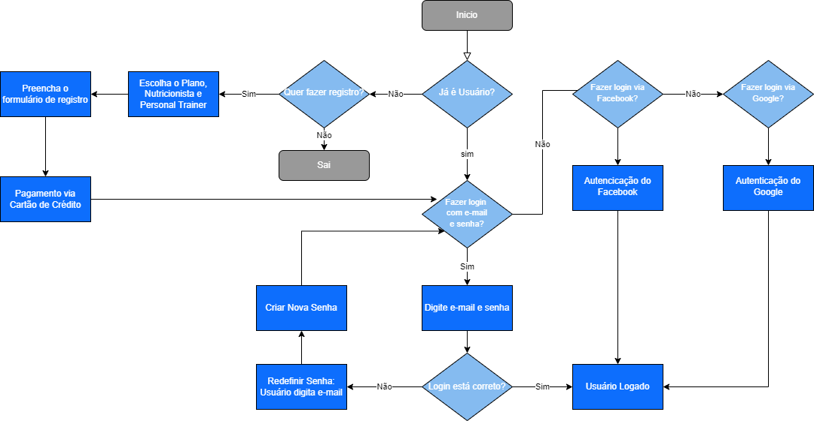

   A navegação após o login será apresentada a seguir, com a interface da página inicial da aplicação para cada tipo de usuário.
   

   1. Administrador
   A figura abaixo apresenta a tela inicial da aplicação para o Administrador. Nela está disponível um menu vertical de navegação a esquerda, com as funcionalidades do sistema. A apresentação de cada funcionalidade é feita a direita da tela. Na parte superior esquerda da tela está disponível o ícone da funcionalidade clicada, para facilitar a localização e a direita o ícone para acessar as funcionalidades do perfil e logout.

   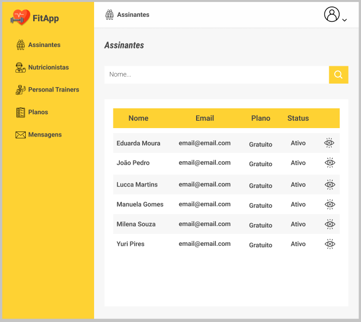

   

   1. Assinante
   A próxima figura apresenta a tela inicial da aplicação para o Assinante. Além do menu vertical a esquerda, que apresenta as funcionalidades do sistema, também é possível ter acesso rápido e facil as informações disponíveis no dashboard a direta da tela. A apresentação de cada funcionalidade também é feita à direita da tela. Na parte superior esquerda da tela está disponível o ícone da funcionalidade clicada, para facilitar a localização e a direita o ícone para acessar as funcionalidades do perfil e logout.

   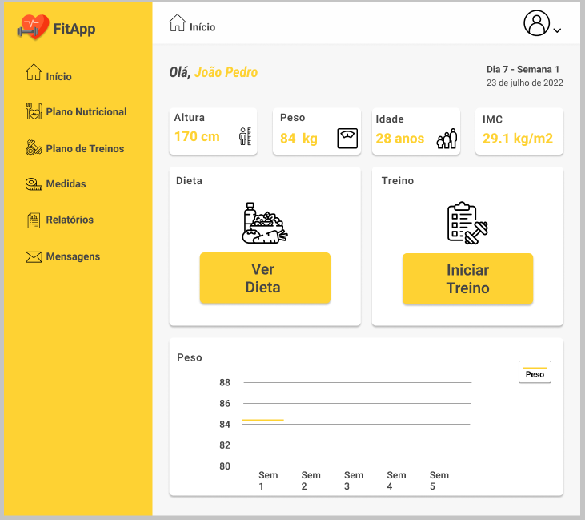

   1. Nutricionista e Personal Trainer
   A seguir, serão apresentadas as telas iniciais da aplicação para o Nutricionista e Personal Trainer. As funcionalidades são as mesmas para ambos os usuários, o que muda é a nomenclatura de alguns termos, por exemplo, paciente e aluno. A tela apresenta um menu vertical de navegação a esquerda, com as funcionalidades do sistema e a apresentação de cada funcionalidade é feita à direita da tela. Na parte superior esquerda da tela está disponível o ícone da funcionalidade clicada, para facilitar a localização e a direita o ícone para acessar as funcionalidades do perfil e logout.

   
   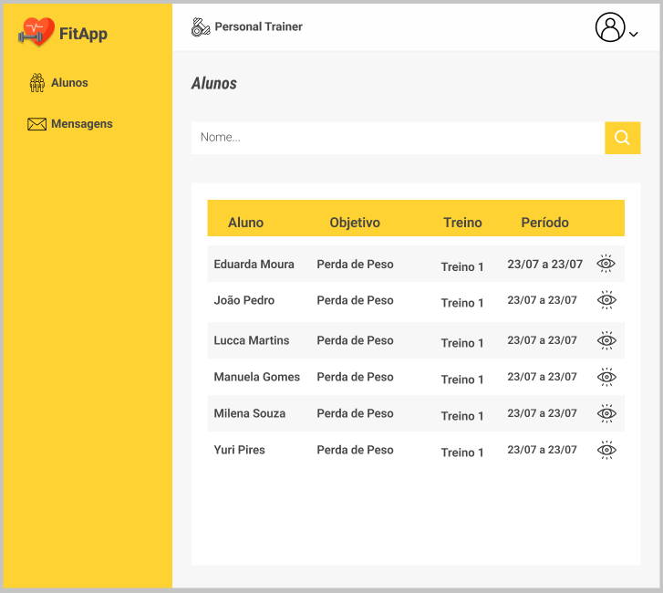
## Diagrama de Classes
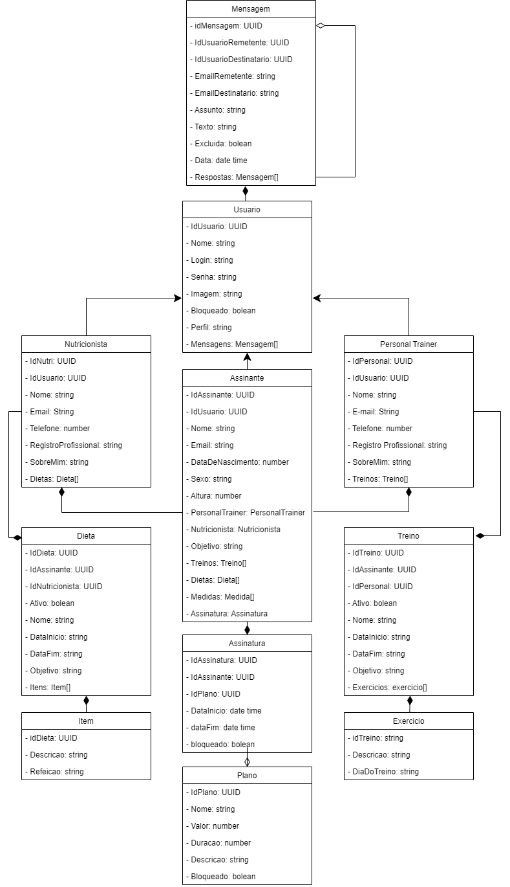

## Arquitetura de software 

1. Padrão Arquitetural

    * MVC (Model-View-Controller) - Foi escolhido porque proporciona uma separação clara de responsabilidades. A implantação do MVC promove melhor manutenibilidade do código, permitindo que, apresentação e informação sejam modificadas de forma independente, diminuindo assim, a carga cognitiva à medida que o sistema cresce.

1. Front-end 

    * HTML (HyperText Markup Language) – Linguagem de Marcação de HiperTexto.

    * Bootstrap (Framework de CSS (Cascading Style Sheets)) – Foi escolhido porque facilita a construção e padronização dos estilos das páginas HTML.

    * JavaScript (Linguagem de programação) – Foi escolhida para adicionar comportamento as páginas HTML. Nenhum framework foi escolhido, no intuído de simplificar o desenvolvimento e publicação do sistema.

1. Back-end

    * Node-js (Software que permite a execução de JavaScript no back-end) - Foi escolhido porque permite o desenvolvimento rápido de API e possibilita o uso da mesma linguagem no Front-end e Back-end.

    * Express-js (Framework para Node.js que fornece recursos mínimos para construção de servidores web (HTTP) – Foi escolhido devido a sua simplicidade para criar APIs.

1. Persistência

    * MySQL (Base de dados relacional) - Foi escolhido porque é simples, leve e por ter um plano de licenciamento grátis.

1. Diagrama de Arquitetura

    * C4 Model – Modelo de diagramação de Arquitetura de Software que abrange níveis diferentes de detalhe. 
  As figuras a seguir apresentam os três primeiros níveis do C4 Model com os detalhes da aplicação.
      1. Diagrama de Contexto
    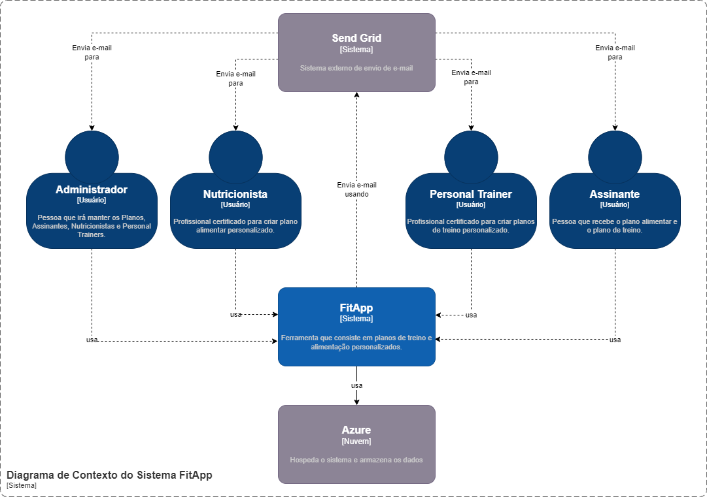
      1. Diagrama de Container
    
      1. Diagrama de Componente
    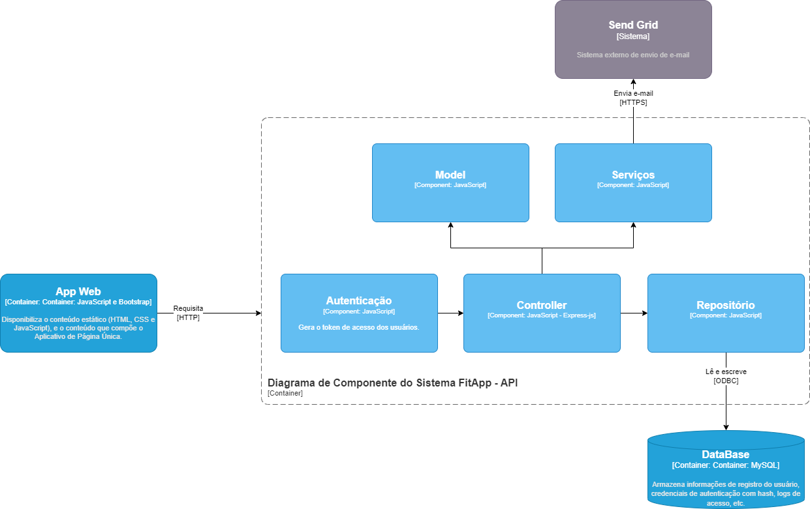

1. Arquitetura da informação 
   
    A estrutura do web site foi feita de forma simples, para que a navegação seja intuitiva e prática.  Desta forma, possui barra de navegação em todo o web site, que disponibiliza links para acessar as páginas com as seguintes seções:
    * Sobre Nós
    * Assinatura
    * Contato
    * Trabalhe Conosco
    * Entrar
    * Registra-se

    A figura abaixo representa as funcionalidades ao iniciar a navegação do web site até o momento que é realizado o login.

    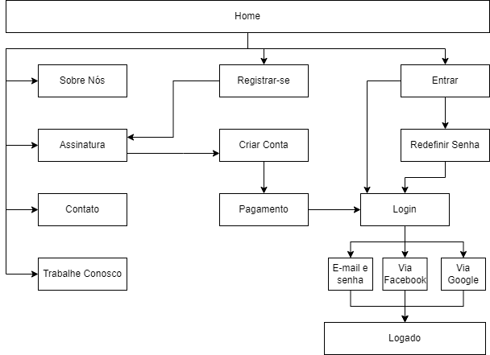

    Após a realização do login, os usuários são direcionados para a página inici-al do aplicativo, que apresenta menu de navegação diferente dependendo do tipo de usuário logado. 
    
    Os diagramas hierárquicos apresentados abaixo, representam as funcionalidades do sistema para cada usuário após realizar o login.

    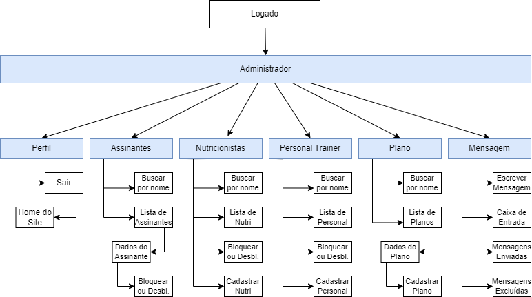

    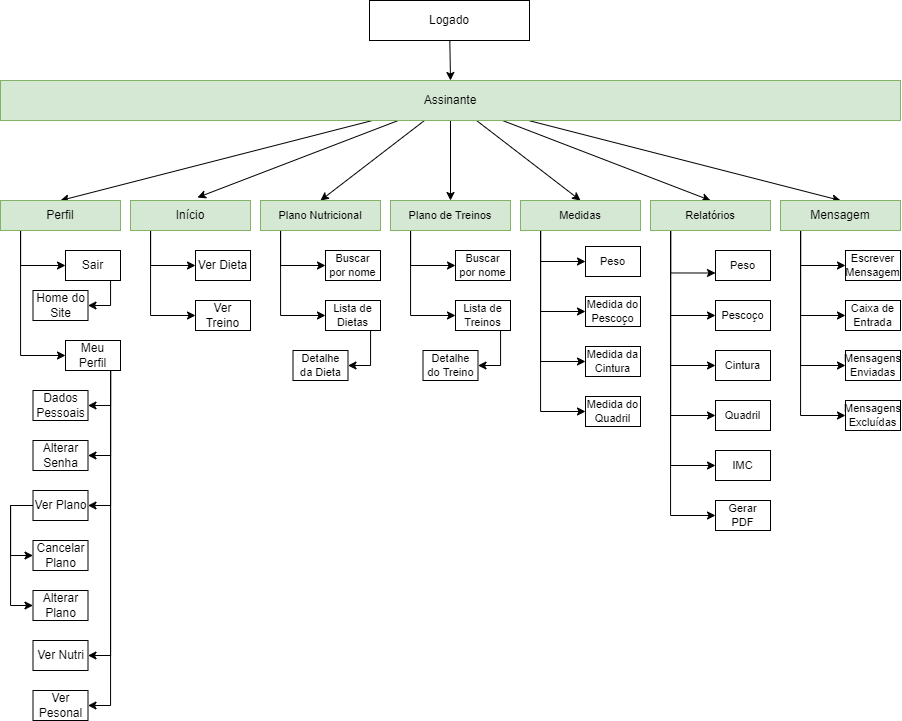

    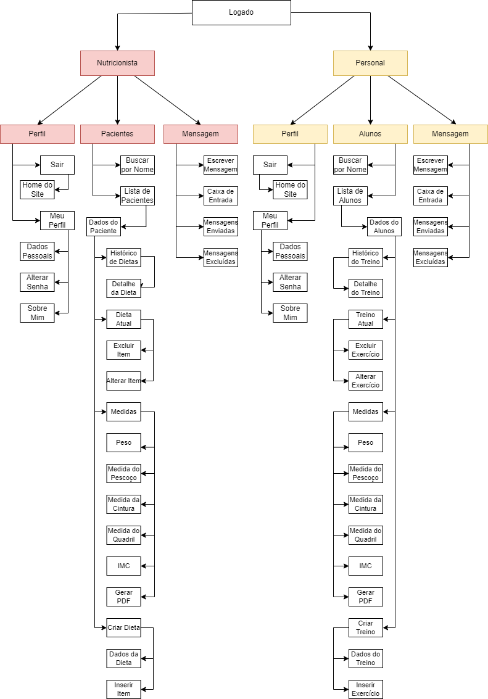

